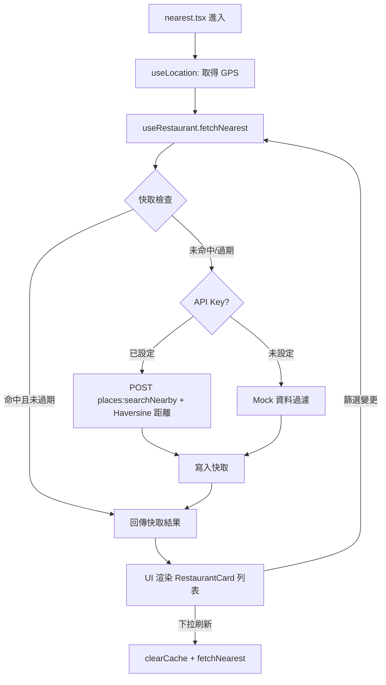
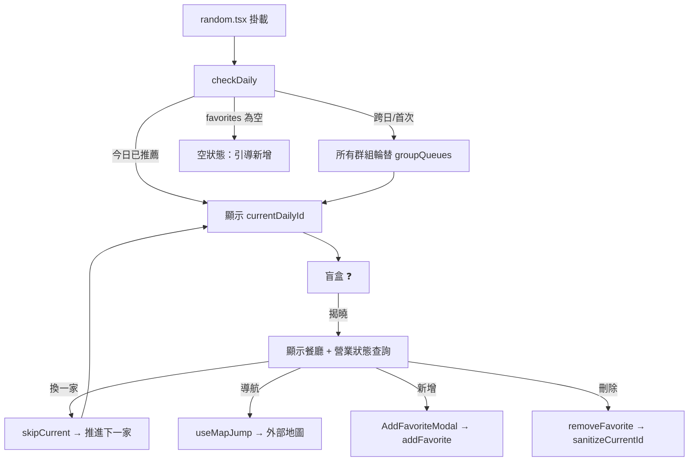
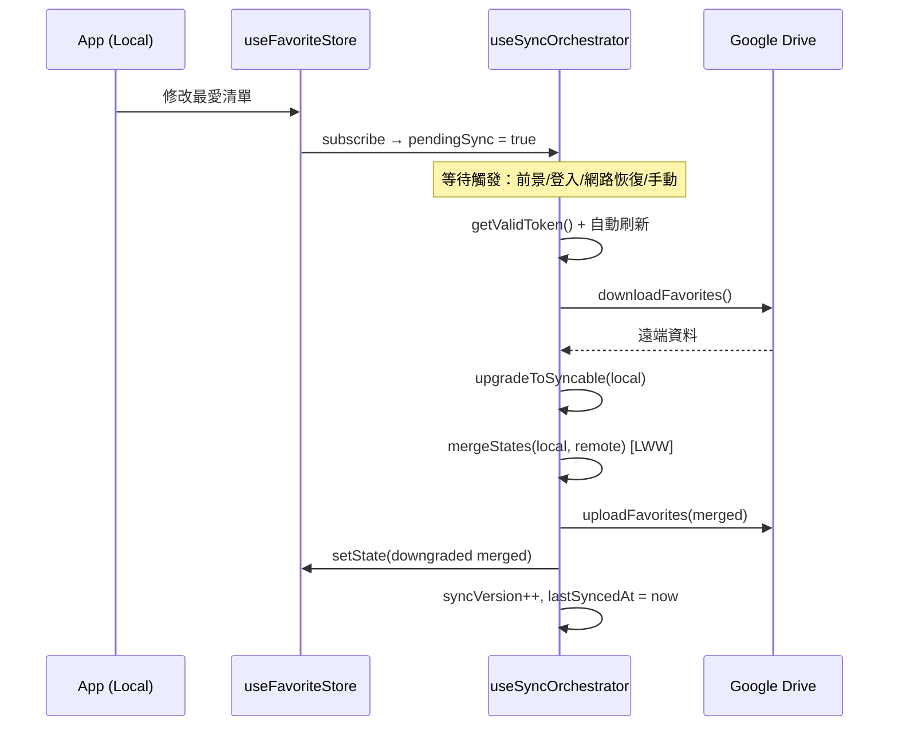
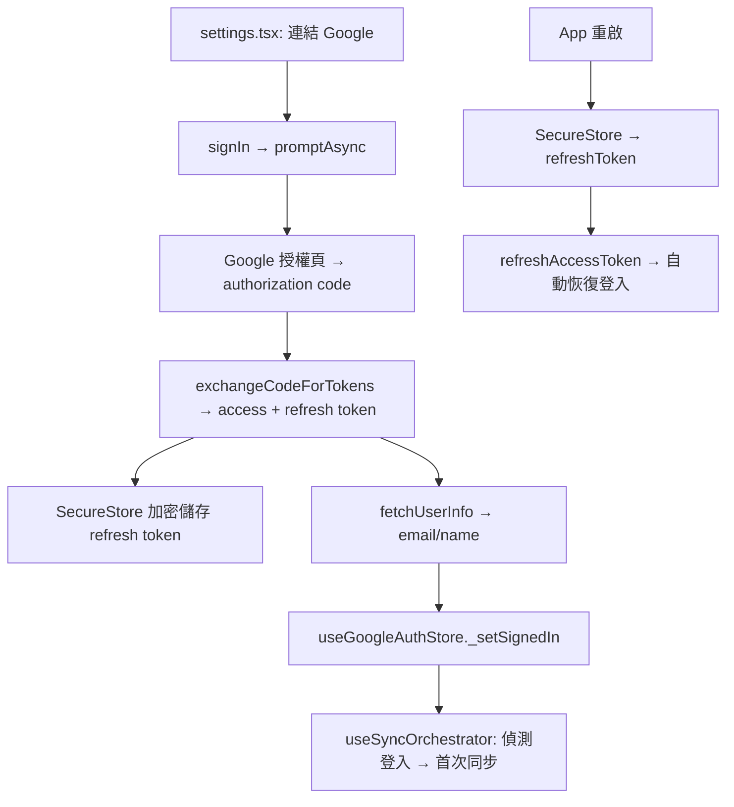

# ARCHITECTURE.md — How-to-eat Mobile App

```yaml
# ──── Project Metadata ────
project: How-to-eat
description: 「今天吃什麼」行動應用程式 — 協助使用者決定每日餐廳
architecture: Local-First + Serverless（無自建後端）
platform: React Native (Expo SDK 54) / Web
language: TypeScript
routing: Expo Router (file-based)
state: Zustand + persist middleware → AsyncStorage
auth: Google OAuth 2.0 (expo-auth-session + PKCE)
cloud_sync: Google Drive REST API v3 (appDataFolder)
api: Google Places API (New) — Nearby Search / Text Search / Place Details
design_system: 統一 Design Token (src/constants/theme.ts)
animation: react-native-reanimated + react-native-gesture-handler

# ──── Persistence Keys ────
storage_keys:
  - key: "favorite-restaurant-storage"
    store: useFavoriteStore
    content: favorites, groups, activeGroupId, groupQueues, groupCurrentDailyIds
  - key: "sync-meta-storage"
    store: useSyncMetaStore
    content: deviceId, syncVersion, lastSyncedAt, pendingSync, syncEnabled
  - key: "user-preferences-storage"
    store: useUserStore
    content: transportMode, maxTimeMins, themeMode

# ──── Env Variables ────
env:
  EXPO_PUBLIC_GOOGLE_PLACES_API_KEY: Google Places API Key（未設定 → Mock 降級）
  EXPO_PUBLIC_GOOGLE_CLIENT_ID: Google OAuth Client ID（未設定 → 停用雲端同步）
  EXPO_PUBLIC_GOOGLE_MAPS_SCHEME: Google Maps URL Scheme
```

> 📄 **頁面 UI 詳細規格**（按鈕清單、UI 區塊、組件設計規範）：[PAGE_SPEC.md](./PAGE_SPEC.md)
> ☁️ **雲端同步與認證架構**（Google OAuth、同步排程、合併策略）：[SYNC_ARCHITECTURE.md](./SYNC_ARCHITECTURE.md)

---

## 1. Navigation Structure

```
Stack Navigator（根）
├── index        → 首頁（隱藏 Header）
├── (tabs)       → Tab 群組（隱藏 Stack Header）
│   ├── random   → 最愛抽獎（Tab 1）
│   └── nearest  → 附近美食（Tab 2）
├── menu         → 功能清單（隱藏 Header）
├── favorites/   → 最愛清單（Nested Stack）
│   ├── index       → P4a 群組列表頁
│   └── [groupId]   → P4b 群組詳情頁
└── settings     → 偏好設定
```

---

## 2. File Registry

### `app/` — 頁面層

| 檔案 | 職責 | 讀取 Store | 依賴 Hook/Service |
|------|------|------------|-------------------|
| `_layout.tsx` | 根 Layout — GestureHandler → AppThemeProvider → (RootLayoutInner: React Navigation ThemeProvider → Stack)。初始化 Google Auth + 同步排程器。Web Pointer-Events 修復 | — | `useGoogleAuth`, `useSyncOrchestrator`, `AppThemeProvider`, `useResolvedThemeMode` |
| `+html.tsx` | Web HTML 模板（`lang="zh-TW"`） | — | — |
| `index.tsx` | 首頁入口：「隨機抽取」+「找最近的」按鈕，☰ → menu，Avatar → auth 狀態 | `useGoogleAuthStore` | — |
| `menu.tsx` | 功能清單：帳號卡片 + MenuItem（❤ 最愛清單 / ⚙ 偏好設定） | `useGoogleAuthStore`, `useSyncMetaStore` | `useGoogleAuth` |
| `favorites/_layout.tsx` | 群組 Stack 導航配置 | — | — |
| `favorites/index.tsx` | **P4a** 群組列表：群組卡片（名稱/數量/啟用 Badge）、三點選單、FAB 新增群組 | `useFavoriteStore` | — |
| `favorites/[groupId].tsx` | **P4b** 群組詳情：餐廳管理（拖曳排序/滑動刪除）、`AddFavoriteModal` 新增、佇列指示器 | `useFavoriteStore` | `useMapJump`, `usePlaceSearch` |
| `settings.tsx` | 偏好設定：雲端同步管理 / 資料匯出匯入（不需登入）/ 交通偏好。使用模組級 `performSync` | `useUserStore`, `useGoogleAuthStore`, `useSyncMetaStore`, `useFavoriteStore` | `useGoogleAuth`, `useNetworkStatus` |
| `(tabs)/_layout.tsx` | Tab Bar 配置（2 tab），Header 左側 HomeButton | — | — |
| `(tabs)/random.tsx` | 最愛抽獎：盲盒模式 → 揭曉（營業狀態查詢），分類 Chip 篩選，三種新增模式 | `useFavoriteStore` | `useMapJump`, `usePlaceSearch` |
| `(tabs)/nearest.tsx` | 附近美食：GPS + 分類篩選，下拉刷新 `clearCache()` | `useUserStore`, `useFavoriteStore` | `useLocation`, `useRestaurant`, `useMapJump` |

### `src/auth/` — Google OAuth 認證

| 檔案 | 職責 | 暴露 API |
|------|------|----------|
| `googleConfig.ts` | OAuth 常數集中管理（Client ID / Scopes / Discovery URL / Drive API URL） | `isGoogleConfigured()`, `GOOGLE_DRIVE_API`, `REQUIRED_SCOPE` |
| `useGoogleAuth.ts` | OAuth 2.0 PKCE Flow Hook。Access Token 存記憶體（1hr），Refresh Token 存 secure-store。模組級 `_moduleRefreshToken` 確保多實例共享 | `signIn()`, `signOut()`, `getValidToken()` |
| `authInterceptor.ts` | 全域 Auth Interceptor（關注點分離）— 避免 `fetchWithResilience`（utils）直接依賴 `useGoogleAuth`（auth）的循環依賴 | `setAuthRefreshHandler(fn)`, `runGlobalAuthRefresh()` |
| `oauthCallbackHandler.ts` | Web OAuth popup 回調處理 — BroadcastChannel 解決 COOP 限制，模組頂層執行，防重複 + HMR 相容 | （自動執行） |

### `src/sync/` — Google Drive 雲端同步

| 檔案 | 職責 | 暴露 API |
|------|------|----------|
| `GoogleDriveAdapter.ts` | Drive REST API v3 封裝（appDataFolder scope）。無狀態純函式，`fetchWithRetry()` 指數退避，`DriveApiError` 自訂錯誤 | `findFavoritesFile()`, `downloadFavorites()`, `uploadFavorites()`, `deleteFavoritesFile()`, `checkDriveConnectivity()` |
| `mergeStrategy.ts` | LWW per-item 合併策略。Tombstone TTL 7 天。格式轉換 `upgradeToSyncable()` / `downgradeFromSyncable()` | `mergeStates(local, remote)` |
| `useSyncOrchestrator.ts` | Local-First 同步排程器：pendingSync 標記 → 前景/登入/網路恢復時觸發。雙向流程：下載→合併→上傳→回寫 | `performSync()`, `pullFromCloud()`, `triggerSync()` |

#### LWW 合併規則

| 場景 | 本地 | 遠端 | 結果 |
|------|------|------|------|
| 1 | 新增 | 不存在 | 保留本地 |
| 2 | 不存在 | 新增 | 保留遠端 |
| 3 | 修改 | 修改 | 取 `updatedAt` 較新者 |
| 4 | 修改 | 刪除 | 取 `updatedAt` 較新者 |
| 5 | 刪除 | 修改 | 取 `updatedAt` 較新者 |
| 6 | 刪除 | 刪除 | 保留 tombstone |

#### 同步觸發時機

1. `useFavoriteStore` 變更 → 僅標記 `pendingSync`（不即時同步）
2. App 從背景回前景（AppState）
3. 首次登入 Google 帳號
4. 網路恢復（若 `pendingSync === true`）
5. 手動觸發

### `src/contexts/` — React Context 上下文層

| 檔案 | 職責 | 暴露 API |
|------|------|----------|
| `ThemeContext.tsx` | 動態主題上下文 — 根據 `useUserStore.themeMode` + 系統色彩(useColorScheme) 決定 Light/Dark 主題，提供 colors/shadows/resolvedMode | `AppThemeProvider`, `useThemeColors()`, `useThemeShadows()`, `useResolvedThemeMode()`, `useThemedStyles(factory)` |

### `src/hooks/` — 業務邏輯橋接層

| 檔案 | 職責 | 暴露 API |
|------|------|----------|
| `useRestaurant.ts` | 封裝 `restaurantService` 非同步狀態（loading/error/data） | `fetchNearest()`, `fetchRandom()`, `clearRandom()` |
| `useLocation.ts` | GPS 座標（Web: navigator / Native: expo-location），fallback 台北 | `location`, `loading`, `error` |
| `useMapJump.ts` | 組合外部地圖連結 → `expo-linking` 開啟 | `jumpToMap(address, transportMode)` |
| `useNetworkStatus.ts` | 跨平台網路偵測（Web: navigator.onLine / Native: netinfo） | `isConnected` |
| `usePlaceSearch.ts` | Google Places Text Search（debounce 300ms + race condition 防護） | `search()`, `searchImmediate()`, `clearResults()` |

### `src/services/` — 資料存取層

| 檔案 | 職責 | 暴露 API |
|------|------|----------|
| `restaurant.ts` | 附近餐廳搜尋（雙模式：Places API / Mock fallback），In-Memory 快取（5min TTL, 4位精度） | `getNearest()`, `getRandom()`, `clearCache()` |
| `placeSearch.ts` | Google Places Text Search 封裝 | `searchPlaces(query, locationBias?)` |
| `placeDetails.ts` | 營業狀態查詢，無 API Key 時降級為 `isOpenNow: true` | `getPlaceOpenStatus(placeId)` |
| `googleMapsUrlParser.ts` | Google Maps URL 解析（4 種格式：短連結/長連結/搜尋/PlaceID），Web CORS 代理，批量 Semaphore(3) | `parseGoogleMapsUrl()`, `batchParseGoogleMapsUrls()`, `isGoogleMapsUrl()` |
| `favoriteExportImport.ts` | 匯出/匯入核心邏輯（平台無關）：序列化、多層驗證、覆寫 Store | `buildExportData()`, `parseAndValidateImport()`, `applyImportToStore()` |
| `favoriteFileHandler.ts` | 匯出/匯入 I/O（Web: Blob / Native: expo-file-system + expo-sharing） | `downloadFavoritesFile()`, `pickAndReadFavoritesFile()` |

### `src/store/` — Zustand 全域狀態

| 檔案 | 職責 |
|------|------|
| `favoriteTypes.ts` | 型別定義（FavoriteState, FavoriteGroup, DeletedItemRecord 等） |
| `favoriteUtils.ts` | 工具函式（generateId, createDefaultGroup, sanitizeCurrentId 等） |
| `favoriteMigrations.ts` | 資料遷移（舊版 → 群組結構、DeletedItemRecord 格式升級） |
| `slices/createFavoriteSlice.ts` | 餐廳 CRUD Slice（add/remove/update/findDuplicate） |
| `slices/createGroupSlice.ts` | 群組管理 Slice（create/rename/delete/setActive/getNextGroupName） |
| `slices/createQueueSlice.ts` | 輪替佇列 Slice（checkDaily/skipCurrent/reorderQueue） |
| `useFavoriteStore.ts` | Combined Store（整合 3 Slice + persist + 遷移），僅 86 行 |
| `useDiagnosticStore.ts` | 診斷日誌（Ring Buffer, 200 筆上限，僅記憶體） |
| `useUserStore.ts` | 使用者偏好（transportMode/maxTimeMins），無持久化 |

### `src/components/` — UI 元件

| 檔案 | 職責 |
|------|------|
| `common/Button.tsx` | 通用按鈕 |
| `common/Card.tsx` | 通用卡片容器 |
| `common/Loader.tsx` | 載入指示器（全螢幕/自訂訊息） |
| `common/PageHeader.tsx` | 統一頁面 Header（3 欄式：返回 + 標題 + 右側動作）— settings / menu / random / favorites 共用 |
| `features/AddFavoriteModal.tsx` | 新增餐廳 Modal（搜尋/手動/貼上連結） — P2, P4b 共用 |
| `features/FilterModal.tsx` | 附近餐廳篩選 Modal |
| `features/RestaurantCard.tsx` | 餐廳資訊卡片（名稱/分類/評分/距離/營業狀態） |
| `features/StaticMapPreview.tsx` | 靜態地圖預覽（Google Static Maps API） |

### `src/constants/` · `src/types/` · `src/utils/`

| 檔案 | 職責 |
|------|------|
| `constants/theme.ts` | 全域 Design Token（colors/spacing/borderRadius/typography/shadows） |
| `constants/categories.ts` | 餐廳分類 SSOT（`FOOD_CATEGORIES`, `CATEGORY_LABELS`, `CATEGORY_TO_PLACES_TYPE`） |
| `types/models.d.ts` | 核心型別：`Restaurant`, `PlaceSearchResult`, `Category` |
| `types/api.d.ts` | API 回應型別：`BaseResponse<T>`, 請求參數型別 |
| `utils/fetchWithResilience.ts` | 韌性 Fetch（指數退避 + Rate Limit 1000ms + 逾時 + 401 Auth Interceptor） |
| `utils/helpers.ts` | 通用工具函式 |

---

## 3. Store Schemas

```typescript
// ═══ useFavoriteStore ═══
// Slices Pattern | persist → AsyncStorage["favorite-restaurant-storage"]
interface FavoriteState {
  // ── State ──
  favorites: FavoriteRestaurant[]                    // 所有收藏（含 groupId, latitude?, longitude?）
  groups: FavoriteGroup[]                            // 最多 MAX_GROUPS=10 個群組
  activeGroupId: string                              // 決定抽獎來源與新增目標
  groupQueues: Record<groupId, string[]>             // 各群組輪替佇列
  groupCurrentDailyIds: Record<groupId, string|null> // 各群組今日推薦
  lastUpdateDate: string                             // YYYY-MM-DD
  _deletedFavoriteIds: DeletedItemRecord[]           // tombstone 用（{id, deletedAt}）
  _deletedGroupIds: DeletedItemRecord[]              // tombstone 用

  // ── Favorite Actions (createFavoriteSlice) ──
  addFavorite(name: string, note?: string, extra?: {address?, category?, placeId?, lat?, lng?}): void
  removeFavorite(id: string): void       // → 記錄 _deletedFavoriteIds，自動 sanitizeCurrentId
  updateFavoriteName(id, name): void
  updateFavoriteNote(id, note): void
  findDuplicate(name, placeId?): FavoriteRestaurant | undefined  // 啟用群組內查重

  // ── Group Actions (createGroupSlice) ──
  createGroup(name?: string): FavoriteGroup | null   // 上限 10，預設名稱字母序
  renameGroup(id, name): void
  deleteGroup(id): void                              // 最後一個不可刪
  setActiveGroup(id): void
  getNextGroupName(): string
  getActiveGroupFavorites(): FavoriteRestaurant[]

  // ── Queue Actions (createQueueSlice) ──
  checkDaily(): void                     // 跨日輪替所有群組
  skipCurrent(): void                    // 啟用群組推進下一家
  reorderQueue(newOrder: string[]): void
  getActiveGroupQueue(): string[]
  getActiveGroupCurrentDailyId(): string | null
}

// ── 資料遷移（onRehydrateStorage）──
// 1. 群組遷移：舊版無群組 → 建立預設「群組A」，既有餐廳加 groupId
// 2. 已刪除記錄遷移：string[] → DeletedItemRecord[]（補 deletedAt）

// ═══ useUserStore ═══
// persist → AsyncStorage["user-preferences-storage"]
interface UserState {
  transportMode: 'walk' | 'drive' | 'transit'
  maxTimeMins: number  // 5–60, 步進 5
  themeMode: ThemeMode  // 'light' | 'dark' | 'system'
  setTransportMode(mode: 'walk' | 'drive' | 'transit'): void
  setMaxTimeMins(mins: number): void
  setThemeMode(mode: ThemeMode): void
}

// ═══ useGoogleAuthStore ═══
// 僅記憶體（定義於 src/auth/useGoogleAuth.ts）
interface GoogleAuthState {
  isLoading: boolean
  isSignedIn: boolean
  accessToken: string | null
  tokenExpiresAt: number | null
  user: { email: string; name: string } | null
  error: string | null
}

// ═══ useSyncMetaStore ═══
// persist → AsyncStorage["sync-meta-storage"]
interface SyncMetaState {
  deviceId: string
  syncVersion: number
  lastSyncedAt: string | null
  pendingSync: boolean
  syncStatus: 'idle' | 'syncing' | 'success' | 'error' | 'offline'
  syncError: string | null
  syncEnabled: boolean
}

// ═══ useDiagnosticStore ═══
// 僅記憶體（Ring Buffer）
interface DiagnosticState {
  logs: DiagnosticLog[]        // {level, message, data?, timestamp}
  maxLogs: number              // 預設 200
  addLog(level, msg, data?): void
  clearLogs(): void
  exportLogs(): string
}
```

---

## 4. Data Flows

### 4.1 附近餐廳查詢



### 4.2 每日輪替推薦 + 盲盒抽獎



### 4.3 Google 雲端同步



#### Tombstone 生命週期

1. **本地刪除** → ID + 時間戳寫入 `_deletedFavoriteIds` / `_deletedGroupIds`
2. **準備同步** → `upgradeToSyncable()` 轉為 `isDeleted: true` tombstone
3. **雲端合併** → LWW 決定保留或覆蓋
4. **同步成功** → 清空本地 `_deleted*Ids`
5. **垃圾回收** → `updatedAt` 超過 7 天的 tombstone 自動移除

### 4.4 OAuth 認證流程



### 4.5 資料持久化

```
useFavoriteStore 變更 → Zustand persist → AsyncStorage["favorite-restaurant-storage"]
useSyncMetaStore 變更 → Zustand persist → AsyncStorage["sync-meta-storage"]
useUserStore   變更 → Zustand persist → AsyncStorage["user-preferences-storage"]
App 重啟 → rehydrate → UI 無縫恢復（偏好設定+最愛清單+同步狀態）
```

---

## 5. Security & Privacy

| 面向 | 策略 |
|------|------|
| OAuth Scope | 僅 `drive.appdata`（App 專用隱藏資料夾，無法存取使用者 Drive 檔案） |
| Refresh Token (Native) | `expo-secure-store`（Keychain/Keystore 硬體加密） |
| Refresh Token (Web) | `sessionStorage`（BroadcastChannel 跨 popup 通訊） |
| Access Token | 僅記憶體（Closure 變數），不持久化 |

---

## 6. Error Handling & Resilience

| 機制 | 實作 | 模組 |
|------|------|------|
| API 降級 | Places API 超時/限流/未設定 → Mock 資料 fallback | `restaurant.ts` |
| Storage 復原 | Persist 失敗 → 空狀態/預設值，防禦性遷移 | `favoriteMigrations.ts` |
| 指數退避 | 5xx/Timeout → 延遲遞增重試（max 3 次），4xx 不重試 | `fetchWithResilience.ts` |
| Rate Limiting | 同端點 1000ms 內禁重複請求，防連續點擊/死迴圈 | `fetchWithResilience.ts` |
| Auth Interceptor | HTTP 401 → 自動刷新 Token → 重播請求 | `authInterceptor.ts` |
| 同步鎖 | `syncStatus: 'syncing'` 狀態機，同時間只允許一次同步 | `useSyncOrchestrator.ts` |
| 可觀測性 | Rate Limit/重試/降級 → 自動寫入 DiagnosticStore | `useDiagnosticStore.ts` |

---

## 7. Rules（分層邊界）

```
app/        → 僅 import hooks/, store/, components/, contexts/
contexts/   → 可 import constants/, store/（提供主題上下文）
hooks/      → 可 import services/, store/
components/ → 僅接受 Props + contexts/（useThemeColors 等），不 import services/, store/
store/      → 不 import services/
⚠️ EXCEPTION: nearest.tsx → restaurantService.clearCache()（命令式操作，允許）
```

### 命名慣例

| 類型 | 規則 | 範例 |
|------|------|------|
| 路由檔 (`app/`) | lowercase | `index.tsx`, `settings.tsx` |
| UI 元件 (`components/`) | PascalCase | `RestaurantCard.tsx` |
| Hooks (`hooks/`) | `use` + camelCase | `useRestaurant.ts` |
| Services / Utils | camelCase | `restaurant.ts`, `helpers.ts` |
| Store | `use` + PascalCase + `Store` | `useFavoriteStore.ts` |
| 型別 | PascalCase | `Restaurant`, `GetNearestParams` |
| 全域常數 | UPPER_SNAKE_CASE | `MIN_TIME`, `MAX_TIME` |

---

## 8. Testing

| 測試檔案 | 覆蓋模組 |
|----------|----------|
| `restaurantService.test.ts` | 餐廳服務雙模式（API / Mock） |
| `restaurantServiceCache.test.ts` | 快取機制（命中/過期/清除/座標漂移/TTL） |
| `restaurantServiceFallback.test.ts` | 降級測試（API 失敗 → Mock） |
| `useFavoriteStore.test.ts` | 最愛狀態管理（新增/刪除/跳過/跨日） |
| `mergeStrategy.test.ts` | LWW 合併（新增/修改/刪除/tombstone） |
| `GoogleDriveAdapter.test.ts` | Drive API CRUD |
| `useSyncOrchestrator.test.ts` | 同步排程器整合 |
| `syncE2E.test.ts` | 端對端同步（多裝置/tombstone 傳播） |
| `useNetworkStatus.test.ts` | 跨平台網路偵測 |
| `useRestaurant.test.ts` | Hook 狀態管理與刷新 |
| `fetchWithResilience.test.ts` | 韌性 Fetch（Rate Limit/退避/逾時/Auth） |
| `placeSearch.test.ts` | Text Search 搜尋 |
| `placeDetails.test.ts` | 營業狀態查詢 |
| `googleMapsUrlParser.test.ts` | URL 解析（長/短連結/座標） |
| `batchParseGoogleMapsUrls.test.ts` | 批次解析（並行/失敗容忍） |
| `favoriteExportImport.test.ts` | 匯出/匯入（序列化/驗證/覆寫） |

---

## 9. Technical Debt

| 模組 | 狀態 | 說明 |
|------|------|------|
| ~~useFavoriteStore~~ | ✅ 已解決 (v1.6) | 已拆分為 Slices Pattern（3 slice + types + utils + migrations） |
| URL 解析 | ⚠️ 未解決 | Web 依賴公共 CORS 代理。未來方向：私有 Serverless Function |

---

## 10. Changelog

- **v1.8 (2026-03-24)**: 架構驅動優化同步：新增 contexts/ File Registry、修正 useUserStore 持久化描述 (persist + themeMode)、更新 _layout.tsx Provider 架構、補齊 storage_keys、分層規則納入 contexts/
- **v1.7 (2026-03-23)**: 架構文件 AI-First 最佳化：Frontmatter 元資料、File Registry 表格、TypeScript Store Schema、Mermaid Data Flow、Rules 區塊
- **v1.6 (2026-03-23)**: 架構文件反向同步：P4 拆為 P4a/P4b、Slices 重構標記完成、補齊遺漏模組與測試
- **v1.5 (2026-03-23)**: 新增匯出/匯入功能
- **v1.4 (2026-03-21)**: 消除 nearest.tsx 技術債
- **v1.3 (2026-03-21)**: 補充同步時序圖、離線恢復、安全防護
- v1.2 · v1.1 · v1.0：群組管理 · 雲端同步 · 首版

---

*Last updated: 2026-03-24*
