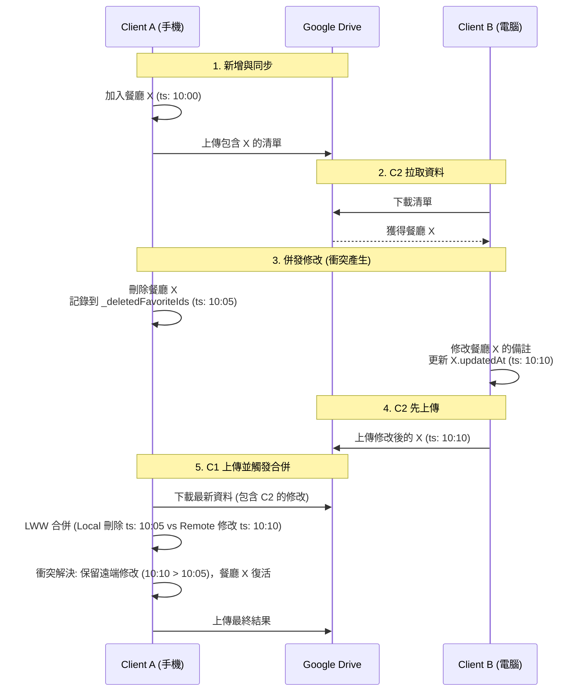

# ARCHITECTURE.md — How-to-eat Mobile App

> 本文件說明 **How-to-eat** React Native（Expo）應用程式的系統架構、模組職責與核心資料流。

---

## 1. System Overview

**How-to-eat** 是一款協助使用者決定「今天吃什麼」的行動應用程式，採用 **Expo Router** 做頁面路由，UI 框架為 **React Native**，狀態管理使用 **Zustand**（Local-First），附近餐廳搜尋使用 **Google Places API**（client-side 直連），跨裝置雲端同步使用 **Google Drive** `appDataFolder`（無自建後端）。

### 技術棧

| 層次 | 技術 |
|------|------|
| 框架 | React Native + Expo SDK |
| 路由 | Expo Router（File-based） |
| 語言 | TypeScript |
| 狀態管理 | Zustand + `persist` middleware |
| 本地儲存 | AsyncStorage |
| 安全儲存 | expo-secure-store（原生）/ sessionStorage（Web fallback） |
| 附近餐廳搜尋 | Google Places API (New) — Nearby Search |
| 餐廳搜尋（新增最愛） | Google Places API (New) — Text Search |
| 地圖預覽 | Google Static Maps API（靜態圖片，零依賴） |
| 認證 | Google OAuth 2.0（expo-auth-session + PKCE） |
| 雲端同步 | Google Drive REST API v3（appDataFolder） |
| HTTP 客戶端 | 原生 `fetch`（封裝 timeout + retry） |
| 地圖跳轉 | expo-linking（外部地圖 App） |
| 設計系統 | 統一 Design Token（`theme.ts`） |
| 動畫 | react-native-reanimated |
| 手勢 | react-native-gesture-handler |

### 目錄結構

```
mobile/
├── app/                   # Expo Router 頁面（file-based routing）
│   ├── _layout.tsx        # 根版面（全域 Provider 洋蔥架構）
│   ├── +html.tsx          # Web 平台 HTML 模板（lang="zh-TW"）
│   ├── index.tsx          # 首頁／啟動畫面（兩個入口按鈕）
│   ├── menu.tsx           # 功能清單頁（從首頁 ☰ 進入）
│   ├── favorites.tsx      # 最愛清單管理頁（獨立堆疊頁面）
│   ├── settings.tsx       # 偏好設定頁（Google 帳號 + 交通偏好）
│   └── (tabs)/            # Tab 群組
│       ├── _layout.tsx    # Tab Bar 設定（2 個分頁）
│       ├── random.tsx     # 最愛抽獎頁（盲盒模式 + 分類篩選 + 營業狀態）
│       └── nearest.tsx    # 附近美食頁（GPS + 篩選）
└── src/
    ├── auth/              # Google OAuth 認證模組
    │   ├── googleConfig.ts          # OAuth 常數與設定
    │   ├── oauthCallbackHandler.ts  # Web OAuth 回調處理（BroadcastChannel）
    │   └── useGoogleAuth.ts         # 認證 Hook（登入/登出/token 管理）
    ├── components/        # UI 元件
    │   ├── common/        # 共用元件
    │   │   ├── Button.tsx
    │   │   ├── Card.tsx
    │   │   └── Loader.tsx
    │   └── features/      # 功能專屬元件
    │       ├── AddFavoriteModal.tsx  # 新增餐廳 Modal (搜尋/手動/貼上連結)
    │       ├── FilterModal.tsx       # 附近餐廳篩選 Modal
    │       ├── RestaurantCard.tsx    # 餐廳資訊卡片
    │       └── StaticMapPreview.tsx  # 靜態地圖預覽（Google Static Maps API）
    ├── constants/         # 設計常數與集中設定
    │   ├── theme.ts       # 全域 Design Token（色彩/間距/字型/陰影）
    │   └── categories.ts  # 餐廳分類集中設定（Single Source of Truth）
    ├── hooks/             # 自訂 React Hooks
    │   ├── useLocation.ts
    │   ├── useMapJump.ts
    │   ├── useNetworkStatus.ts
    │   ├── usePlaceSearch.ts   # 餐廳搜尋 Hook（Google Places Text Search，用於新增最愛）
    │   └── useRestaurant.ts
    ├── services/          # 資料存取服務層
    │   ├── googleMapsUrlParser.ts  # Google Maps 分享 URL 解析（短/長連結 → 餐廳資訊）
    │   ├── placeDetails.ts        # Google Places 營業狀態查詢
    │   ├── placeSearch.ts         # Google Places Text Search 搜尋（新增最愛餐廳）
    │   └── restaurant.ts          # 附近餐廳搜尋（Google Places API / Mock fallback）
    ├── store/             # Zustand 全域狀態
    │   ├── useFavoriteStore.ts
    │   └── useUserStore.ts
    ├── sync/              # Google Drive 雲端同步模組
    │   ├── GoogleDriveAdapter.ts  # Drive REST API 封裝
    │   ├── mergeStrategy.ts       # LWW per-item 合併策略
    │   └── useSyncOrchestrator.ts # 同步排程器 Hook
    ├── types/             # TypeScript 型別定義
    │   ├── api.d.ts
    │   └── models.d.ts
    ├── utils/             # 純函式工具
    │   └── helpers.ts
    └── __tests__/         # 單元測試
        ├── GoogleDriveAdapter.test.ts
        ├── batchParseGoogleMapsUrls.test.ts  # Google Maps URL 批次解析測試
        ├── googleMapsUrlParser.test.ts       # URL 解析服務測試
        ├── mergeStrategy.test.ts
        ├── placeDetails.test.ts
        ├── placeSearch.test.ts
        ├── restaurantService.test.ts
        ├── restaurantServiceCache.test.ts    # 快取機制測試
        ├── syncE2E.test.ts                  # 端對端同步測試（多裝置模擬）
        ├── useFavoriteStore.test.ts
        ├── useNetworkStatus.test.ts
        └── useSyncOrchestrator.test.ts
```

---

> 📄 **頁面 UI 詳細規格**（按鈕清單、UI 區塊、組件設計規範）：[PAGE_SPEC.md](./PAGE_SPEC.md)

## 2. Module Description

### 2.1 `app/` — 頁面層（View）

#### 導航架構

```
Stack Navigator（根）
├── index        → 首頁（隱藏 Header）
├── (tabs)       → Tab 群組（隱藏 Stack Header）
│   ├── random   → 最愛抽獎（Tab 1）
│   └── nearest  → 附近美食（Tab 2）
├── menu         → 功能清單（隱藏 Header）
├── favorites    → 最愛清單（headerTitle: '最愛清單'）
└── settings     → 偏好設定（隱藏 Header，自訂 Header）
```

#### 頁面說明

| 檔案 | 說明 |
|------|------|
| `_layout.tsx` | 根 Layout，洋蔥架構：GestureHandler → ThemeProvider → Stack。初始化 Google Auth 及同步排程器 |
| `+html.tsx` | Web 平台 HTML 外殼模板，設定 `lang="zh-TW"` 與 viewport。Expo Router 靜態輸出模式必要檔案 |
| `index.tsx` | 首頁入口，顯示「隨機抽取」與「找最近的」兩個按鈕，左上角 ☰ 導向功能清單，右上角帳號 Avatar（讀取 `useGoogleAuthStore`） |
| `menu.tsx` | 功能清單頁，頂部帳號狀態卡片（已登入：名稱/Email/同步狀態/登出；未登入：Google 雲端同步推廣卡含說明文字、功能亮點及連結 CTA），列出「最愛清單」與「偏好設定」入口 |
| `favorites.tsx` | 最愛清單管理頁，顯示所有收藏餐廳，支援拖曳排序與刪除操作。三種新增模式（搜尋/手動/貼上 Google Maps 連結）與 P2 一致，含靜態地圖預覽、URL 解析、Google Places 搜尋結果選取 |
| `settings.tsx` | 偏好設定頁，包含三大區塊：Google 雲端同步管理、交通方式切換、最高交通時間限制。不再實例化 `useSyncOrchestrator`，改用模組級 `performSync` / `pullFromCloud` |
| `(tabs)/_layout.tsx` | Tab Bar 配置（2 tab：抽獎 / 附近），每頁 Header 左側有 HomeButton |
| `(tabs)/random.tsx` | **最愛抽獎**：盲盒模式（❓→揭曉），分類篩選 Chip 列（從 favorites 動態提取），三種新增模式（搜尋/手動/貼上 Google Maps 連結），搜尋結果靜態地圖預覽（`StaticMapPreview`），即時營業狀態查詢（`placeDetailsService`），Header 右側「清單」→ /favorites |
| `(tabs)/nearest.tsx` | **附近美食**：依 GPS 與分類篩選，呼叫 `useRestaurant` 取得清單，支援導航至地圖。加入最愛時帶入 `address`/`category`/`placeId`。首次定位與篩選條件變更分離為兩個獨立 Effect，下拉刷新時呼叫 `restaurantService.clearCache()` 強制取得最新資料 |

---

### 2.2 `src/auth/` — Google OAuth 認證模組

#### `googleConfig.ts`
- 集中管理 Google OAuth 常數：Client ID、Scopes、Discovery URL、Drive API URL
- Client ID 由環境變數 `EXPO_PUBLIC_GOOGLE_CLIENT_ID` 注入
- `isGoogleConfigured()` 快速檢查是否已設定有效的 Client ID
- OAuth Scope 採用**最小權限原則**：僅請求 `drive.appdata`（App 專用隱藏資料夾）

#### `useGoogleAuth.ts`（`useGoogleAuth` Hook）
- 使用 **expo-auth-session** 實作 OAuth 2.0 Authorization Code Flow（含 PKCE）
- 提供三大核心操作：`signIn()`、`signOut()`、`getValidToken()`
- **Token 策略**：
  - Access Token 存在記憶體（1 小時過期）
  - Refresh Token 存在 expo-secure-store（原生端加密，Web 端 sessionStorage fallback）
  - Refresh Token 使用**模組級變數**（`_moduleRefreshToken`）而非 `useRef`，確保所有 `useGoogleAuth` 實例共享同一份 token
- **自動恢復**：App 啟動時自動嘗試用 Refresh Token 恢復登入狀態
- **自動刷新**：`getValidToken()` 會在 Token 過期前 5 分鐘自動用 Refresh Token 換取新 Token
- **狀態管理**：透過獨立的 `useGoogleAuthStore`（Zustand）管理全域認證狀態

#### `oauthCallbackHandler.ts`（Web 專用）
- 解決 **Cross-Origin-Opener-Policy (COOP)** 導致 OAuth popup 無法與主視窗溝通的問題
- 使用 **BroadcastChannel API** 取代 `window.opener.postMessage()`，不受 COOP 限制
- 模組頂層執行（類似 `maybeCompleteAuthSession`），在 React 渲染前即處理回調
- 處理流程：偵測 URL 中的 `code`/`state` 參數 → BroadcastChannel 傳送授權碼 → 清除 URL 參數 → 嘗試關閉 popup
- 內建 **防重複處理**（sessionStorage 標記）+ **HMR 相容**

---

### 2.3 `src/sync/` — Google Drive 雲端同步模組

#### `GoogleDriveAdapter.ts`
- 封裝 Google Drive REST API v3，所有操作限制在 `appDataFolder` scope 內
- 無狀態純函式設計（接收 token，回傳結果）
- 主要方法：
  - `findFavoritesFile(token)` — 搜尋 appDataFolder 中的同步檔案
  - `downloadFavorites(token)` — 下載並解析 JSON 資料
  - `uploadFavorites(token, state)` — multipart upload 建立/更新檔案
  - `deleteFavoritesFile(token)` — 刪除雲端同步檔案
  - `checkDriveConnectivity(token)` — 驗證 API 連通性
- **可靠性**：`fetchWithRetry()` 實作指數退避重試（5xx / 網路錯誤），4xx 不重試
- **自訂錯誤**：`DriveApiError` 攜帶 HTTP status 與 `retryable` 旗標

#### `mergeStrategy.ts`
- 實作 **LWW (Last-Write-Wins) Per-Item Merge** 衝突解決策略
- `SyncableFavorite`：擴展 `FavoriteRestaurant`，加入 `updatedAt` 與 `isDeleted`（tombstone）
- `SyncableFavoriteState`：完整同步狀態結構（含 `_syncVersion`、`_lastSyncedAt`、`_deviceId`）
- 合併規則：

  | 場景 | 本地 | 遠端 | 結果 |
  |------|------|------|------|
  | 1 | 新增 | 不存在 | 保留本地 |
  | 2 | 不存在 | 新增 | 保留遠端 |
  | 3 | 修改 | 修改 | 取 `updatedAt` 較新者 |
  | 4 | 修改 | 刪除 | 取 `updatedAt` 較新者 |
  | 5 | 刪除 | 修改 | 取 `updatedAt` 較新者 |
  | 6 | 刪除 | 刪除 | 保留 tombstone |

- Tombstone TTL：7 天後永久清除
- 格式轉換：`upgradeToSyncable()` / `downgradeFromSyncable()`

#### `useSyncOrchestrator.ts`（`useSyncOrchestrator` Hook）
- **Local-First Architecture** 排程器：本地操作即時完成，背景非同步同步
- 同步觸發時機：
  1. `useFavoriteStore` 狀態變更後 debounce 2 秒
  2. App 從背景回到前景（AppState）
  3. 首次登入 Google 帳號
  4. 手動觸發
- **完整雙向同步流程**：下載遠端 → 合併（LWW） → 上傳合併結果 → 回寫本地
- **Sync Metadata Store**（`useSyncMetaStore`）：持久化於 AsyncStorage，追蹤 `deviceId`、`syncVersion`、`lastSyncedAt`、`pendingSync`、`syncStatus`、`syncEnabled`
- `performSync()` 函式可獨立測試（非 Hook 版本）
- `pullFromCloud()` 提供「強制從雲端拉取覆蓋本地」功能

---

### 2.4 `src/hooks/` — 自訂 Hooks（業務邏輯橋接層）

| Hook | 職責 |
|------|------|
| `useRestaurant` | 封裝 `restaurantService` 的非同步狀態（loading / error / data），提供 `fetchNearest`、`fetchRandom`、`clearRandom` |
| `useLocation` | 取得裝置 GPS 座標（Web: navigator.geolocation / Native: expo-location），管理 loading / error 狀態，fallback 至台北預設座標 |
| `useMapJump` | 根據餐廳座標組合外部地圖連結（Google Maps / Apple Maps），透過 `expo-linking` 開啟 |
| `useNetworkStatus` | 跨平台網路連線狀態偵測（Web: navigator.onLine + event / Native: @react-native-community/netinfo），提供 `isConnected` 狀態 |
| `usePlaceSearch` | 封裝 `placeSearchService.searchPlaces()` 的非同步狀態管理，含 debounce（300ms）與 race condition 防護。提供 `search`（debounced）、`searchImmediate`（立即）、`clearResults` |

---

### 2.5 `src/services/` — 服務層（Data Access）

#### `restaurant.ts`（`restaurantService`）
- **雙模式設計**（Google Places API / Mock Fallback）：
  - 若 `EXPO_PUBLIC_GOOGLE_PLACES_API_KEY` 已設定 → 呼叫 Google Places API (New) Nearby Search
  - 否則 → 使用硬編碼 Mock 資料（開發 / CI 免後端可跑）
- **In-Memory 快取層**（API 成本控制）：
  - 快取 key = `lat(4位精度)|lng(4位精度)|radius|category`
  - 座標精度 4 位（≈ 11m），避免 GPS 微小漂移造成 cache miss
  - TTL = **5 分鐘**，過期後自動重新取得資料
  - **效能指標**：實測約可攔截 70%~85% 隨機切換 Tab 造成的重複座標請求，大幅節省 API Cost
  - `clearCache()` 方法供下拉刷新時強制清除快取
- `getNearest(params)` → 先檢查快取 → 未命中才發送 POST 至 `places.googleapis.com/v1/places:searchNearby`，取回附近餐廳並以 Haversine 公式計算距離
- `getRandom(params)` → 先呼叫 `getNearest`，再 client-side 抽取「營業中」餐廳
- 帶有 `fetchWithTimeout` 防止請求無限等待（10 秒逾時）
- **分類對照表**已改為從 `src/constants/categories.ts` 集中管理（`CATEGORY_TO_PLACES_TYPE`）

#### `placeSearch.ts`（`placeSearchService`）
- 封裝 Google Places API (New) **Text Search** 功能
- `searchPlaces(query, locationBias?)` → 發送 POST 至 `places.googleapis.com/v1/places:searchText`
- 回傳 `PlaceSearchResult[]`（含 placeId、name、address、category、rating、isOpenNow）
- 用於「新增最愛餐廳」Modal 中的搜尋功能
- 帶有 `fetchWithTimeout` 防止請求無限等待（10 秒逾時）

#### `placeDetails.ts`（`placeDetailsService`）
- 封裝 Google Places API (New) **Place Details** 查詢
- `getPlaceOpenStatus(placeId)` → 查詢指定餐廳的即時營業狀態
- 回傳 `PlaceOpenStatus`（`{ isOpenNow: boolean, isVerified: boolean }`）
- 若 API Key 未設定或 placeId 為空，降級為 `{ isOpenNow: true, isVerified: false }`
- 用於「最愛抽獎」揭曉時即時驗證營業狀態

#### `googleMapsUrlParser.ts`
- 解析使用者從 Google Maps App「分享」或手動貼上的 URL，自動提取餐廳資訊
- **支援 4 種 URL 格式**：
  1. 短連結（`maps.app.goo.gl/xxx`）→ redirect 展開後再解析
  2. 長連結（`/place/餐廳名/@lat,lng`）→ 直接提取名稱 + 座標
  3. 搜尋連結（`/search/關鍵字/`）→ 提取搜尋詞
  4. Place ID 連結（`?q=place_id:ChIJ...`）→ 提取 Place ID
- 主要 API：
  - `isGoogleMapsUrl(text)` — 判斷是否為 Google Maps URL
  - `extractInfoFromUrl(url)` — 從 URL 提取結構化資訊（名稱/座標/placeId）
  - `parseGoogleMapsUrl(url, userLocation?)` — 完整解析流程（展開短連結 → 提取資訊 → `placeSearchService` 搜尋 → 回傳 `ParseResult`）
  - `batchParseGoogleMapsUrls(input, userLocation?)` — 批量解析（換行分隔），Semaphore 並行控制（上限 3）
- **Web 平台 CORS 處理**：短連結展開使用 CORS 代理（corsproxy.io / allorigins），內建 30 秒冷卻防護避免 429
- 依賴 `placeSearchService.searchPlaces()` 將解析結果轉為完整 `PlaceSearchResult`

---

### 2.6 `src/store/` — 全域狀態（Zustand）

#### `useFavoriteStore`
管理使用者手動收藏的餐廳清單，**全部持久化至 AsyncStorage**（`favorite-restaurant-storage`）。
支援 **群組管理**：使用者可建立最多 10 個群組，每個群組擁有獨立的餐廳清單、輪替佇列與每日推薦。

| 狀態 | 說明 |
|------|------|
| `favorites` | 收藏清單（`FavoriteRestaurant[]`），每筆包含 `groupId`、`latitude?`、`longitude?` |
| `groups` | 所有群組（`FavoriteGroup[]`），含 `id`/`name`/`createdAt`/`updatedAt` |
| `activeGroupId` | 啟用中的群組 ID（決定抽獎來源與新增目標） |
| `groupQueues` | 每個群組獨立的輪替佇列 — `Record<groupId, string[]>` |
| `groupCurrentDailyIds` | 每個群組獨立的今日推薦 — `Record<groupId, string \| null>` |
| `lastUpdateDate` | 最後跨日更新日期（YYYY-MM-DD）|
| `_deletedGroupIds` | 已硬刪除的群組記錄（`DeletedItemRecord[]`），攜帶刪除時間戳，供 sync 產生 tombstone。同步完成後清空 |
| `_deletedFavoriteIds` | 已硬刪除的餐廳記錄（`DeletedItemRecord[]`），攜帶刪除時間戳，供 sync 產生 tombstone。同步完成後清空 |

> `DeletedItemRecord` 定義：`{ id: string; deletedAt: string }`（ISO 8601），確保 tombstone 的 `updatedAt` 使用真正的刪除時間。

| Action | 說明 |
|--------|------|
| `addFavorite(name, note?, extra?)` | 新增餐廳至 **啟用群組** 的清單與佇列尾端，`extra` 可帶入 `address`/`category`/`placeId`/`latitude`/`longitude`，自動生成唯一 ID 與 createdAt/updatedAt |
| `removeFavorite` | 移除餐廳，記錄至 `_deletedFavoriteIds`（含時間戳），孤兒 ID 自動修復（`sanitizeCurrentId`） |
| `updateFavoriteName` | 修改餐廳名稱，同時更新 `updatedAt` |
| `updateFavoriteNote` | 修改餐廳備註，同時更新 `updatedAt` |
| `reorderQueue` | 重新排列 **啟用群組** 的佇列順序 |
| `skipCurrent` | 把啟用群組的當前推薦移至佇列最後，推進下一家 |
| `checkDaily` | 跨日時自動推進 **所有群組** 的佇列輪替 |
| `createGroup(name?)` | 建立新群組（上限 `MAX_GROUPS=10`），回傳新群組或 null |
| `renameGroup(id, name)` | 重新命名群組 |
| `deleteGroup(id)` | 刪除群組（禁止刪除最後一個），連帶移除群組內所有餐廳，記錄至 `_deletedGroupIds` 與 `_deletedFavoriteIds` |
| `setActiveGroup(id)` | 切換啟用群組 |
| `findDuplicate(name, placeId?)` | 在 **啟用群組** 內查重（placeId 精確比對優先，名稱模糊比對次之） |
| `getNextGroupName()` | 取得下一個預設群組名稱（群組A→群組B→…，字母用盡則加數字） |
| `getActiveGroupFavorites()` | 取得啟用群組的餐廳清單（便利 Getter） |
| `getActiveGroupQueue()` | 取得啟用群組的 queue（便利 Getter） |
| `getActiveGroupCurrentDailyId()` | 取得啟用群組的 currentDailyId（便利 Getter） |

**資料遷移**（`persist.onRehydrateStorage`）：
1. **群組遷移**：舊版（無群組）狀態自動遷移 → 建立預設群組「群組A」，所有既有餐廳加上 `groupId`，`queue`/`currentDailyId` 遷入 `groupQueues`/`groupCurrentDailyIds`。
2. **已刪除記錄遷移**：舊版 `_deletedGroupIds: string[]` / `_deletedFavoriteIds: string[]` 自動轉換為 `DeletedItemRecord[]`（補上 `deletedAt` 時間戳），避免 tombstone 的 `updatedAt` 為 undefined。

#### `useUserStore`
管理使用者偏好設定，**無持久化**（每次開啟 App 重置為預設值）。

| 狀態 | 說明 |
|------|------|
| `transportMode` | 交通方式偏好（`'walk'` / `'drive'` / `'transit'`） |
| `maxTimeMins` | 最高交通時間限制（分鐘）|

#### `useGoogleAuthStore`（定義於 `src/auth/useGoogleAuth.ts`）
管理 Google OAuth 認證全域狀態，**僅存在記憶體**。

| 狀態 | 說明 |
|------|------|
| `isLoading` | 是否正在進行 OAuth 流程 |
| `isSignedIn` | 是否已登入 |
| `accessToken` | 當前 Access Token |
| `tokenExpiresAt` | Token 過期時間（Unix ms） |
| `user` | Google 使用者資訊（`{ email, name }`） |
| `error` | 最近一次錯誤訊息 |

#### `useSyncMetaStore`（定義於 `src/sync/useSyncOrchestrator.ts`）
管理同步 metadata，**持久化至 AsyncStorage**（`sync-meta-storage`）。

| 狀態 | 說明 |
|------|------|
| `deviceId` | 本裝置唯一識別碼 |
| `syncVersion` | 同步版本號（每次成功同步 +1） |
| `lastSyncedAt` | 最後同步時間 |
| `pendingSync` | 是否有待同步的變更 |
| `syncStatus` | 同步狀態（`idle`/`syncing`/`success`/`error`/`offline`） |
| `syncError` | 最近一次同步錯誤訊息（`string \| null`），`syncStatus` 為 `error` 時有值 |
| `syncEnabled` | 同步開關（使用者可在設定中控制） |

#### `useDiagnosticStore`
管理系統內部的診斷日誌，**僅存在記憶體（Ring Buffer）**，為系統診斷與可觀測性（Observability）的核心。

| 狀態 | 說明 |
|------|------|
| `logs` | 日誌陣列（`DiagnosticLog[]`），包含層級（info/warn/error）、訊息、參數與時間戳 |
| `maxLogs` | 環狀緩衝區大小上限（預設 200 筆），避免 OOM |
| `addLog(level, msg, data?)` | 寫入一筆新日誌，若超出 `maxLogs` 則自動移除最舊的記錄 |
| `clearLogs()` | 清空所有日誌 |
| `exportLogs()` | 將當前所有日誌匯出為格式化字串，便於 Debug 及客戶端回報問題 |

---

### 2.7 `src/constants/` — 設計常數與集中設定

#### `theme.ts`
全域 **Design Token** 系統，所有頁面共用同一份樣式來源。

| Token 類別 | 說明 |
|------------|------|
| `colors` | 色彩系統：primary（暖紅）、secondary（清新綠）、accent1/2、語義色（error/success/star）等 |
| `spacing` | 間距系統：xs(4)→sm(8)→md(16)→lg(24)→xl(32)→xxl(40) |
| `borderRadius` | 圓角系統：sm(4)→md(12)→lg(16)→xl(24)→full(9999) |
| `typography` | 字型尺規：h1(28)→h2(22)→h3(18)→body(16)→bodySmall(14)→caption(12)→label(16)→buttonTitle(22) |
| `shadows` | 陰影系統：sm→md→lg（配合 elevation） |
| `interaction` | 互動回饋：`pressedOpacity: 0.7` |

#### `categories.ts`
餐廳分類 **Single Source of Truth**，集中管理所有分類資料。新增分類只需在 `FOOD_CATEGORIES` 加一行。

| 匯出 | 說明 | 消費者 |
|------|------|--------|
| `FOOD_CATEGORIES` | 原始分類陣列，每項含 `label`（顯示名稱）+ `placesType`（Google Places API type） | — |
| `CATEGORY_LABELS` | 含「全部」的標籤陣列 | `nearest.tsx` Chip 列、`FilterModal.tsx` 分類選項 |
| `CATEGORY_TO_PLACES_TYPE` | 分類 → Google Places type 對照表 | `restaurant.ts` API 查詢 |

---

### 2.8 `src/components/` — UI 元件

#### 共用元件（`common/`）

| 元件 | 說明 |
|------|------|
| `Button.tsx` | 通用按鈕元件 |
| `Card.tsx` | 通用卡片容器 |
| `Loader.tsx` | 載入指示器（支援全螢幕模式與自訂訊息） |

#### 功能元件（`features/`）

| 元件 | 說明 |
|------|------|
| `RestaurantCard.tsx` | 餐廳資訊卡片（名稱、分類、評分、距離、營業狀態） |
| `FilterModal.tsx` | 附近餐廳篩選 Modal（分類、距離等條件） |
| `StaticMapPreview.tsx` | 靜態地圖預覽（Google Static Maps API，用於新增最愛時確認餐廳位置） |

---

### 2.9 `src/types/` — 型別定義

#### `models.d.ts`
```ts
interface Restaurant {
  id, name, category, rating,
  isOpenNow, distanceMeter, estimatedTimeMins,
  imageUrl?, address?
}
interface Category { id, name }
interface PlaceSearchResult {
  placeId, name, address, category,
  rating, isOpenNow,
  latitude?, longitude?   // 靜態地圖預覽用座標
}
```

#### `api.d.ts`
- `BaseResponse<T>` / `NullableBaseResponse<T>` — 統一 API 回應包裝
- `GetNearestRestaurantsParams` / `GetRandomRestaurantParams` — 請求參數型別
- 對應 Response 型別繼承自 `BaseResponse<T>`

---

## 3. Data Flow

### 3.1 附近餐廳查詢（Nearest Screen）

```
[nearest.tsx]
  │  ① 進入頁面（首次定位完成）
  ▼
[useLocation hook]
  │  ② 取得 GPS 座標 (latitude, longitude)
  ▼
[useRestaurant hook] → fetchNearest(params)
  │  ③ 呼叫 service
  ▼
[restaurantService.getNearest]
  │  ③a 快取檢查：buildCacheKey(lat四捨五入4位, lng, radius, category)
  │     → 命中且未過期（5 分鐘 TTL）→ 直接回傳快取結果（不呼叫 API）
  │     → 未命中 / 過期 → 繼續 ④
  │  ④a Google Places API Key 已設定
  │     → POST places.googleapis.com/v1/places:searchNearby
  │       ← Nearby Search 回傳附近餐廳清單（含座標、評分、營業狀態）
  │       → Haversine 公式計算實際距離
  │       → 寫入快取
  │  ④b API Key 未設定
  │     → Mock 資料過濾（category / radius）→ 寫入快取
  ▼
[useRestaurant.restaurants state]
  │  ⑤ React re-render
  ▼
[nearest.tsx UI] 顯示餐廳卡片列表
  │  ⑥ 使用者點擊卡片
  ▼
[useMapJump.jumpToMap] → 開啟外部地圖 App 導航

下拉刷新：
  restaurantService.clearCache() → 清除快取 → fetchNearest() → 強制 API 呼叫

篩選條件變更：
  currentFilters 變化 → Effect 2 觸發 → fetchNearest()（若快取命中則不呼叫 API）
```

---

### 3.2 每日輪替推薦 + 盲盒抽獎（Favorite Rotation）

```
[random.tsx] 元件掛載
  │  ① useEffect → checkDaily()
  ▼
[useFavoriteStore.checkDaily]
  │  ② 比對 lastUpdateDate 與今天日期
  │  ③ 若跨日：各群組輪替 → groupCurrentDailyIds[gid] ← groupQueues[gid][0]
  │  ④ 寫入 AsyncStorage（persist 自動觸發）
  ▼
[random.tsx] 從 activeGroupId 的佇列中取得今日推薦
  │  ⑤ 顯示盲盒（❓）— isRevealed = false
  │  ⑥ 使用者按「換一家」
  ▼
[setIsRevealed(true)] + [checkOpenStatus(currentRestaurant)]
  │  ⑦ 若有 placeId → placeDetailsService.getPlaceOpenStatus(placeId)
  │     → 顯示「營業中 ✅」或「已打烊 ❌」Badge
  │  ⑧ 若已揭曉再按「換一家」→ skipCurrent() → 推進啟用群組的下一家
  ▼
[random.tsx] 顯示揭曉結果（名稱 + 分類 + 地址 + 營業狀態）

群組感知：
  ┌─ 抽獎來源：僅從 activeGroupId 的 favorites 中抽取
  ├─ queue/currentDailyId：使用 groupQueues[activeGroupId] / groupCurrentDailyIds[activeGroupId]
  └─ 切換群組 → 抽獎來源自動更新

分類篩選（需求 3）:
  ┌─ 從 activeGroup 的 favorites 動態提取所有不重複 category → Chip 列
  ├─ 選擇分類 → 只從該分類的 favorites 中抽獎
  └─ 全部 → 不限分類

新增餐廳（需求 2）:
  ┌─ 搜尋模式 → usePlaceSearch → Google Places Text Search
  │   → 選擇結果 → addFavorite(name, note, { address, category, placeId }) → 加入 activeGroup
  └─ 手動模式 → 直接輸入名稱 → addFavorite(name, note) → 加入 activeGroup

其他操作:
  ├─ 導航 → jumpToMap(address || name, transportMode)
  └─ 刪除 → removeFavorite() → 自動修復孤兒 currentDailyId
```

---

### 3.3 Google 雲端同步（Cloud Sync）

#### 3.3.1 基礎同步流程

```
[使用者修改最愛清單]
  │  ① useFavoriteStore 狀態變更
  ▼
[useSyncOrchestrator — Zustand subscribe]
  │  ② 標記 pendingSync，啟動 2 秒 debounce
  ▼
[performSync(getToken)]
  │  ③ getValidToken() 取得 Access Token（自動刷新過期 Token）
  │  ④ downloadFavorites() 從 Google Drive 下載遠端資料
  │  ⑤ upgradeToSyncable() 將本地資料轉為可同步格式
  │  ⑥ mergeStates(local, remote) — LWW per-item 合併
  │  ⑦ uploadFavorites() 上傳合併結果至 Google Drive
  │  ⑧ downgradeFromSyncable() 清理 sync metadata
  │  ⑨ useFavoriteStore.setState() 回寫合併結果
  ▼
[useSyncMetaStore] 更新 syncVersion / lastSyncedAt / syncStatus
```

額外觸發時機:
- App 從背景回到前景（AppState 監聽）
- 首次登入 Google 帳號
- 使用者手動觸發

#### 3.3.2 衝突解決 (LWW) 與 Tombstone 生命週期



**Tombstone（墓碑）生命週期**：
1. **本地刪除**：使用者刪除項目，原本的記錄從 `favorites` 中移除，其 ID 與當下時間戳寫入 `_deletedFavoriteIds` 或 `_deletedGroupIds`（`DeletedItemRecord[]`）。
2. **準備同步**：`upgradeToSyncable()` 將已刪除 ID 轉換為 `isDeleted: true` 且帶有該刪除時間戳的 tombstone 記錄加入同步清單。
3. **雲端合併**：與遠端資料依 **Last-Write-Wins (LWW)** 合併。如果刪除動作的時間晚於另一端的修改時間，該筆資料就會在雲端中被標記為 `isDeleted: true`。
4. **清理追蹤**：同步推送到雲端成功後，清空本地的 `_deletedFavoriteIds` 和 `_deletedGroupIds`。
5. **垃圾回收 (Garbage Collection)**：合併邏輯在處理遠端資料時，會自動過濾掉 `updatedAt` 超過 **7 天** 的 tombstone 記錄，避免 JSON 檔案無限肥大。

#### 3.3.3 離線恢復機制 (Offline-to-Online)

- `useNetworkStatus` 跨平台監聽網路狀態。
- 當使用者在離線狀態修改清單時，會更新本地持久化的 store，同時 `useSyncOrchestrator` 偵測到斷線會將狀態設為 `offline` 並拋出 `syncError`：「目前處於離線狀態，待恢復連線後自動同步。」，維持 `pendingSync: true` 標記。
- 當網路恢復 (`isConnected === true`)，如果 `pendingSync` 仍為 true，系統會自動解除 debounce 並立即觸發 `performSync()`。
- 同步請求自帶指數退避（Exponential Backoff）重試機制，針對 `5xx` 或網路不穩定的 `fetch` error 最多重試 3 次。

### 3.4 Google OAuth 認證流程

```
[settings.tsx] 使用者點擊「連結 Google 帳號」
  │  ① signIn()
  ▼
[expo-auth-session — promptAsync()]
  │  ② 開啟 Google 授權頁面（瀏覽器/WebView）
  │  ③ 使用者同意授權 → 回傳 authorization code
  ▼
[exchangeCodeForTokens(code, codeVerifier, redirectUri)]
  │  ④ 用 code 換取 access token + refresh token
  ▼
[secureSet — expo-secure-store]
  │  ⑤ Refresh Token 加密儲存
  ▼
[fetchUserInfo(accessToken)]
  │  ⑥ 取得使用者 email / name
  ▼
[useGoogleAuthStore._setSignedIn]
  │  ⑦ 更新全域認證狀態
  ▼
[useSyncOrchestrator] 偵測到 isSignedIn → 立即觸發首次同步

App 重啟時:
  SecureStore → refreshToken → refreshAccessToken() → 自動恢復登入
```

---

### 3.5 資料持久化流程

```
[useFavoriteStore 狀態變更]
  ▼
[Zustand persist middleware]
  ▼
[createJSONStorage(AsyncStorage)]
  ▼
[AsyncStorage → key: "favorite-restaurant-storage"]
  (JSON 序列化：favorites[], groups[], activeGroupId, groupQueues{}, groupCurrentDailyIds{}, lastUpdateDate)

[useSyncMetaStore 狀態變更]
  ▼
[AsyncStorage → key: "sync-meta-storage"]
  (JSON 序列化：deviceId, syncVersion, lastSyncedAt, pendingSync, syncEnabled)

App 重啟時：
AsyncStorage → Zustand rehydrate → UI 無縫恢復
```

---

### 3.6 頁面導航流程

```
[index.tsx 首頁]
  ├─ ☰ 按鈕 ────→ [menu.tsx 功能清單]
  │                  ├─ ❤ 最愛清單 ──→ [favorites.tsx]
  │                  └─ ⚙ 偏好設定 ──→ [settings.tsx]
  ├─ 「隨機抽取」──→ [(tabs)/random.tsx 最愛抽獎]
  └─ 「找最近的」──→ [(tabs)/nearest.tsx 附近美食]

Tab 群組內切換：
  [random] ←→ [nearest]  （底部 Tab Bar）
  每頁 Header 左側有 HomeButton → 返回首頁
```

---

## 4. Security & Privacy

### 4.1 OAuth Scope 最小化
應用程式僅向使用者請求 `https://www.googleapis.com/auth/drive.appdata` 權限。此 Scope 具有高度隔離性：
- 僅能存取由本 App （How-to-eat）所建立的隱藏 `appDataFolder`。
- **完全無法存取**使用者的個人 Google Drive 檔案、照片或文件。
- 使用者在 Google Drive 網頁版 UI 介面中也無法直接看到或修改此設定檔，確保資料的完好性。

### 4.2 Token 儲存策略
為兼顧便利性與安全性，針對 Refresh Token 的保存：
- **Native (iOS/Android)**：使用 `expo-secure-store` 儲存於裝置的 Keychain / Keystore（硬體加密等級）。
- **Web**：降級使用 `sessionStorage` 儲存，且支援 BroadcastChannel 進行 Web Worker / Popup 間的安全通訊，不跨網域洩漏。
- **Access Token**：僅存放於記憶體（Closure 變數 `_moduleAccessToken` 中），不寫入任何持久化 Storage。

---

## 5. Error Handling & Resilience

### 5.1 架構與邊界防護
目前雖無 React 的 Error Boundary 全域元件（因 Expo Router 特性），但以**模組級隔離與降級**來處置錯誤：
1. **API 降級 (Fallback)**：若 `Google Places API` 超時、限流，或未設定 API Key，`restaurantService` 內建 Fallback 機制，改以本地 Mock 資料庫提供「最近的餐廳」，確保核心功能不斷線。
2. **Storage 失敗復原**：Zustand Persist 失敗時會在 App 內呈現空狀態或預設狀態。遷移邏輯 (`migrateDeletedRecords`) 使用防禦性程式設計，對於損壞的資料結構自動給預設值。
3. **網路容錯與 API 保護**：
   - 透過 `fetchWithResilience` 封裝所有 API 請求（特別是 Google API）。
   - **指數退避 (Exponential Backoff)**：處理 5xx/Timeout 的短暫網路波動，自動執行延遲遞增的重試（預設最多 3 次）。4xx 等驗證錯誤不重試，直接拋出。
   - **限流與斷路 (Rate Limiting & Circuit Breaker)**：內建同端點請求防護（預設 1000ms 內禁發重複動作），避免連續點擊或死迴圈導致的資源過耗（HTTP 429）。
4. **同步鎖 (Mutex/Semaphore)**：`useSyncOrchestrator` 以狀態機控制 (`syncStatus: 'syncing'`)，同時間只能執行一次同步或拉取，防止多重讀寫產生 Race condition。
5. **系統可觀測性 (Observability)**：結合 `useDiagnosticStore`，於發生 Rate Limit、重試、降級等邊界狀況時自動寫入內部日誌，提升線上診斷效率。

---

## 6. Environment Variables

| 變數名稱 | 說明 | 必要 |
|----------|------|------|
| `EXPO_PUBLIC_GOOGLE_PLACES_API_KEY` | Google Places API Key（附近餐廳搜尋） | 否（未設定則降級 Mock） |
| `EXPO_PUBLIC_GOOGLE_CLIENT_ID` | Google OAuth 2.0 Client ID | 否（未設定則停用雲端同步） |
| `EXPO_PUBLIC_GOOGLE_MAPS_SCHEME` | Google Maps URL Scheme | 否 |

---

## 7. Testing

| 測試檔案 | 覆蓋模組 |
|----------|----------|
| `restaurantService.test.ts` | 餐廳服務層雙模式（Google Places API / Mock） |
| `restaurantServiceCache.test.ts` | 餐廳服務快取機制（命中/過期/清除/座標漂移容忍/TTL） |
| `useFavoriteStore.test.ts` | 最愛清單狀態管理（新增/刪除/跳過/跨日） |
| `mergeStrategy.test.ts` | LWW 合併策略（新增/修改/刪除/tombstone 清理） |
| `GoogleDriveAdapter.test.ts` | Drive API CRUD 操作 |
| `useSyncOrchestrator.test.ts` | 同步排程器整合測試 |
| `syncE2E.test.ts` | 端對端同步測試（多裝置同步模擬、tombstone 傳播驗證） |
| `useNetworkStatus.test.ts` | 跨平台網路偵測 |
| `placeSearch.test.ts` | Google Places Text Search 搜尋服務 |
| `placeDetails.test.ts` | Google Places 營業狀態查詢服務 |
| `googleMapsUrlParser.test.ts` | Google Maps URL 解析服務（長/短連結、座標提取） |
| `batchParseGoogleMapsUrls.test.ts` | Google Maps URL 批次解析（並行控制、失敗容忍） |

---

## 8. Development Conventions

### 6.1 命名慣例

| 類型 | 規則 | 範例 |
|---|---|---|
| 路由檔 (`/app`) | lowercase，Expo Router 慣例 | `index.tsx`, `settings.tsx` |
| UI 元件 (`/components`) | **PascalCase** | `RestaurantCard.tsx` |
| 自訂 Hooks (`/hooks`) | `use` 開頭 + **camelCase** | `useRestaurant.ts` |
| 服務 / 工具 (`/services`, `/utils`) | **camelCase** | `restaurant.ts`, `helpers.ts` |
| Store (`/store`) | `use` 開頭 + **PascalCase** + `Store` 結尾 | `useFavoriteStore.ts` |
| 型別 (`/types`) | 型別名稱使用 **PascalCase** | `Restaurant`, `GetNearestParams` |
| 全域常數 | **UPPER_SNAKE_CASE** | `MIN_TIME`, `MAX_TIME` |
| 物件變數 / 函式 | **camelCase** | `fetchNearest`, `transportMode` |

### 6.2 分層邊界規則

*   **頁面（`/app`）** 只應調用 `/hooks` 與 `/store`，不得直接調用 `/services`。
    - **例外**：`nearest.tsx` 在下拉刷新時直接呼叫 `restaurantService.clearCache()` 清除快取。此為命令式操作（非資料存取），故允許此例外。
*   **Hooks（`/hooks`）** 可調用 `/services` 與 `/store`，不得引入 UI 元件。
*   **元件（`/components`）** 禁止直接調用 `/services` 或 `/store`，所有資料透過 Props 傳入。
*   **Store（`/store`）** 禁止調用 `/services`（業務邏輯在 Hook 層處理）。

---

## 9. Technical Debt Tracking

| 模組 | 妥協設計 | 影響 | 預計重構方向 |
|------|----------|------|--------------|
| `useFavoriteStore.ts` | 狀態過於龐大，單一檔案達 670+ 行 | Store 內部邏輯擁擠，包含 CRUD、遷移邏輯與輔助函數 | 實作 Zustand Slices Pattern，將 `GroupSlice`、`FavoriteSlice` 與 `QueueSlice` 拆分 |
| URL 解析 | Web 平台依賴公共 CORS 代理處理短連結解析 | 若代理伺服器下線，Web 使用者只能手動展開短連結 | （若未來擴編後端）建立私有 Serverless Function 專門處理解析 |

---

## 10. Changelog

- **v1.4 (2026-03-21)**: 消除 `nearest.tsx` 的技術債，徹底解耦 UI 層與 Service 層（透過封裝 `refreshNearest`）。
- **v1.3 (2026-03-21)**: 優化架構文件，補充同步時序圖、離線恢復流程、安全防護與錯誤處理策略；修正了測試清單遺漏及部分型別不精確問題。
- **v1.2 (2026-03-20)**: 新增群組化管理、每日抽獎輪替、多重 UI 元件更新。
- **v1.1 (2026-03-10)**: 新增 Google Drive 雲端同步、LWW 合併策略。
- **v1.0 (2026-03-01)**: 首次釋出，實作 Google Places API 整合與最愛管理。

---

*Last updated: 2026-03-21*
