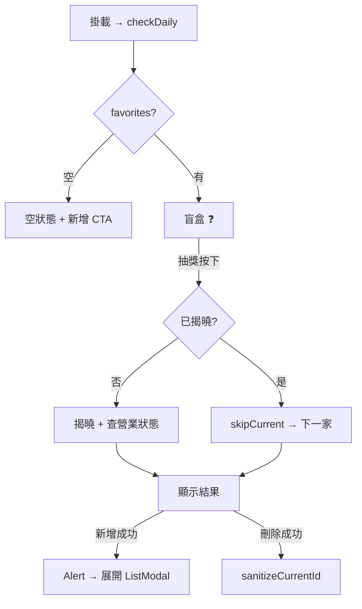
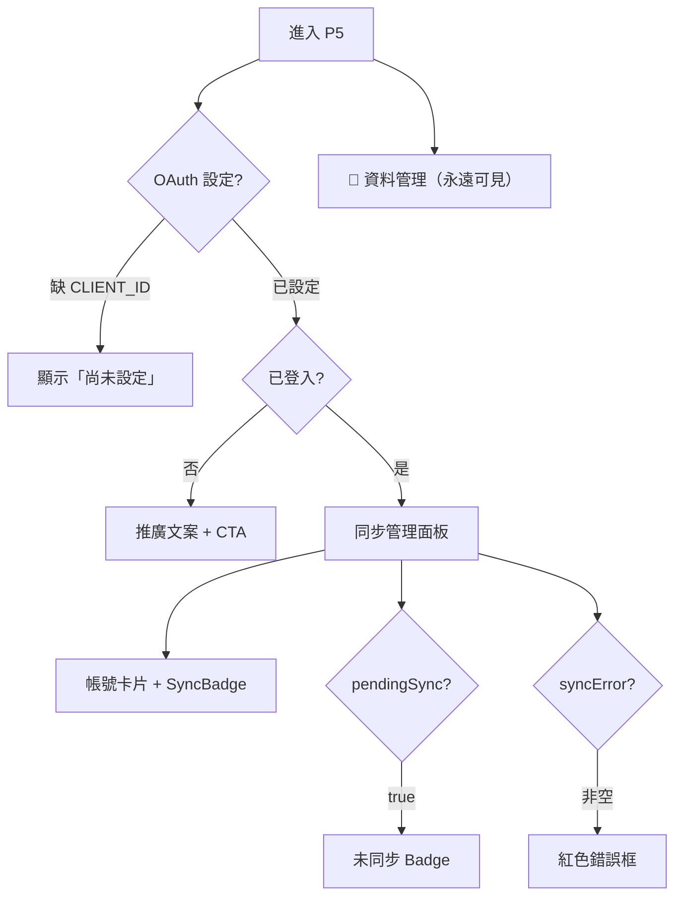
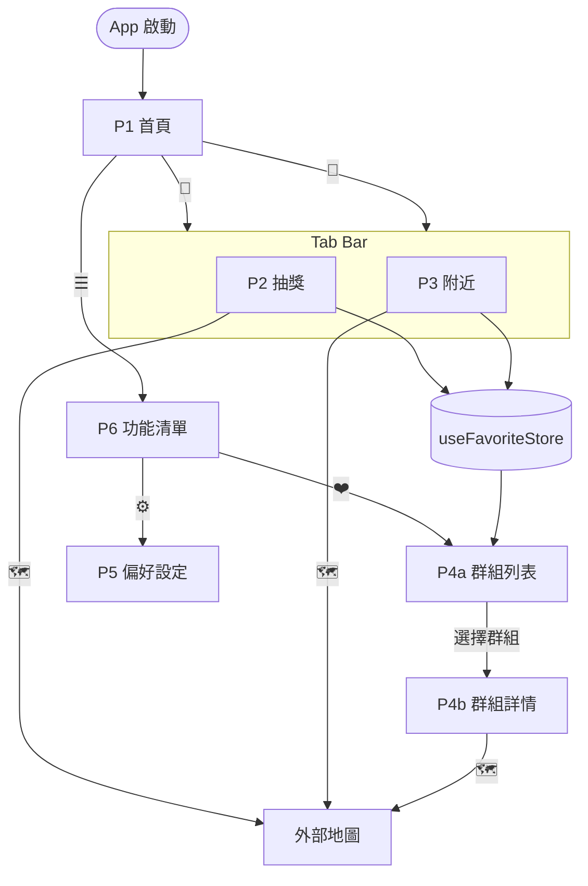

# PAGE_SPEC.md — 前端頁面 UI 規格書

```yaml
# ──── Document Metadata ────
scope: 頁面 UI 結構、按鈕邏輯、組件設計規範
ssot_for: UI 區塊 / 按鈕 ID 與行為 / 組件 Props / 視覺規範
not_covered: 模組職責、Store Schema、Data Flow → 見 ARCHITECTURE.md
version: v1.7
updated: 2026-03-24
```

---

## 1. 頁面總覽

| 編號 | 名稱 | 路由 | 類型 |
|:---:|---|---|:---:|
| P1 | 首頁 | `app/index.tsx` | Stack |
| P2 | 最愛抽獎 | `app/(tabs)/random.tsx` | Tab |
| P3 | 附近美食 | `app/(tabs)/nearest.tsx` | Tab |
| P4a | 群組列表 | `app/favorites/index.tsx` | Stack (Nested) |
| P4b | 群組詳情 | `app/favorites/[groupId].tsx` | Stack (Nested) |
| P5 | 偏好設定 | `app/settings.tsx` | Stack |
| P6 | 功能清單 | `app/menu.tsx` | Stack |

---

## 2. 頁面詳細規格

---

### P1 `app/index.tsx` — 首頁

**UI 區塊**

| 區塊 | 描述 |
|---|---|
| Header 左上 | ☰ 漢堡選單 → P6 |
| Header 右上 | 👤 Avatar（登入：彩色首字母；未登入：灰色 outline）→ P5 |
| 主視覺 | App 名稱 / Logo |
| 入口按鈕群 | 「隨機抽取」+「找最近的」大型 CTA |

**Buttons**

| ID | 名稱 | 樣式 | 動作 |
|:---:|---|:---:|---|
| B1-1 | 🎲 隨機抽取 | `primary` | Tab Navigate → P2 |
| B1-2 | 📍 找最近的 | `primary` | Tab Navigate → P3 |
| B1-3 | ☰ 功能清單 | `icon` | Stack Push → P6 |
| B1-4 | 👤 Avatar | `icon` | Stack Push → P5 |

---

### P2 `app/(tabs)/random.tsx` — 最愛抽獎

**UI 區塊**

| 區塊 | 描述 |
|---|---|
| 分類 Chip 列 | 動態從 activeGroup favorites 提取不重複 category，含「全部」 |
| 盲盒卡片 | ❓ + 「從 N 家最愛中隨機抽取」 |
| 揭曉卡片 | 🍽️ 餐廳名稱 + 分類 + 備註 + 地址 + 營業狀態 Badge |
| 營業 Badge | 🟢 營業中 / 🔴 已打烊 / ❓ 無法確認 |
| 操作按鈕列 | 導航 + 抽獎（🎲） |
| AddModal | 三模式（搜尋/手動/貼連結）— 共用 `AddFavoriteModal` |
| ListModal | 半螢幕：FlatList 餐廳列表，含刪除，當前推薦標記 🍽️ |
| 空狀態 | 🍽️ + 「還沒有最愛餐廳」+ 新增 CTA |

**Buttons**

| ID | 名稱 | 樣式 | 動作 |
|:---:|---|:---:|---|
| B2-1 | 🎲 抽獎 | `secondary` | 首次：揭曉 + 查營業狀態。再次：`skipCurrent` 輪替。`disabled`: 揭曉且 queue ≤ 1 |
| B2-2 | 🗑️ 刪除 | `danger` | Alert → `removeFavorite(id)` |
| B2-3 | ➕ 新增（空狀態 CTA） | `primary` | 開啟 AddModal |
| B2-4 | 🧭 導航 | `primary` | `jumpToMap(address \|\| name, transportMode)` |
| B2-5 | 📋 清單（Header 右） | `text` | `router.push('/favorites')` → P4a |

**State Logic**



---

### P3 `app/(tabs)/nearest.tsx` — 附近美食

**UI 區塊**

| 區塊 | 描述 |
|---|---|
| 篩選 Bar | 分類標籤橫向滑動 |
| FilterModal | 進階篩選（距離/評分/分類） |
| 餐廳清單 | `FlatList` + `RestaurantCard`，下拉刷新 |
| 空狀態 | 無結果提示 |

**Buttons**

| ID | 名稱 | 樣式 | 動作 |
|:---:|---|:---:|---|
| B3-1 | 🔽 篩選 | `secondary` | 開啟 FilterModal → 確認後 `fetchNearest()` |
| B3-2 | ❤️ 加入最愛 | `icon` | `addFavorite(restaurant)` |
| B3-3 | 🗺️ 導航 | `icon` | `useMapJump()` → 外部地圖 |
| B3-4 | 🔄 刷新（下拉） | — | `clearCache()` → `fetchNearest()` |

---

### P4a `app/favorites/index.tsx` — 群組列表

**UI 區塊**

| 區塊 | 描述 |
|---|---|
| 自訂 Header | ← 返回 + 「最愛清單」 |
| 群組卡片列表 | 每卡片：名稱 + 餐廳數 + 啟用中 Badge + 三點選單 |
| 三點選單 Modal | 啟用群組 / 重新命名 / 刪除（最後一個不可刪） |
| 建立/重命名 Modal | 輸入框 + 確認/取消 |
| FAB | ⊕ 新增群組（字母序預設名，上限 10） |

**Buttons**

| ID | 名稱 | 樣式 | 動作 |
|:---:|---|:---:|---|
| B4a-1 | 群組卡片 | `pressable` | `router.push('/favorites/${groupId}')` → P4b |
| B4a-2 | … 三點選單 | `icon` | 彈出管理 Modal |
| B4a-3 | ⊕ 新增群組 (FAB) | `primary` | 建立群組 Modal，達上限時 Alert |
| B4a-4 | ← 返回 | `icon` | `router.back()` |

---

### P4b `app/favorites/[groupId].tsx` — 群組詳情

**UI 區塊**

| 區塊 | 描述 |
|---|---|
| 自訂 Header | ← 返回 + 群組名稱 + 「編輯」 |
| 佇列順序指示器 | 今日 → 明日 → 後日… |
| 最愛清單 | 拖曳排序 + Swipe-to-delete |
| FAB | ➕ 開啟 `AddFavoriteModal` |
| AddFavoriteModal | 三模式（搜尋/手動/貼連結），加入當前群組 |
| 空狀態 | 群組名稱 + P3 探索 CTA + 手動新增 CTA |

**Buttons**

| ID | 名稱 | 樣式 | 動作 |
|:---:|---|:---:|---|
| B4b-1 | ✏️ 編輯排序 | `text` | 拖曳模式 → 更新 `groupQueues[groupId]` |
| B4b-2 | 🗑️ 刪除 | `danger` | `removeFavorite(id)` |
| B4b-3 | 🗺️ 導航 | `icon` | `useMapJump()` |
| B4b-4 | ➕ 探索餐廳 | `primary` | Tab Switch → P3 |
| B4b-5 | ➕ FAB 新增 | `primary` (FAB) | 開啟 AddFavoriteModal → 加入當前群組 |
| B4b-6 | ➕ 手動新增 | `secondary` | 開啟 AddFavoriteModal（手動模式） |
| B4b-7 | ← 返回 | `icon` | `router.back()` → P4a |

---

### P5 `app/settings.tsx` — 偏好設定

**UI 區塊**

| 區塊 | 描述 |
|---|---|
| 自訂 Header | ← 返回 + 「偏好設定」 |
| ☁️ 雲端同步 | 帳號連結 / 同步 Badge / 自動同步 Toggle / 手動同步 / 取消連結 |
| 📄 資料管理 | **獨立區塊（不需登入）**：匯出 JSON + 匯入 JSON + 餐廳數量 |
| 🎨 外觀主題 | 三選一 Radio Card：☀️ 淺色(Light) / 🌙 深色(Dark) / 📱 跟隨系統(System)。下方提示文字隨選擇動態更新 |
| 交通方式 | Radio Card：🚶 走路 / 🚗 機車 / 🚌 大眾運輸 |
| 時間限制 | ➖/➕ + 進度條，5–60 分鐘，步進 5 |

**Buttons**

| ID | 名稱 | 樣式 | 動作 |
|:---:|---|:---:|---|
| B5-1 | 🚶 走路 | `segmented` | `transportMode = 'walk'` |
| B5-2 | 🚗 機車/開車 | `segmented` | `transportMode = 'drive'` |
| B5-3 | 🚌 大眾運輸 | `segmented` | `transportMode = 'transit'` |
| B5-4 | ← 返回 | `icon` | `router.back()` |
| B5-5 | 🔗 連結 Google | `primary` | `signIn()` |
| B5-6 | 🔄 立即同步 | `primary` | `triggerSync()` |
| B5-7 | 🚪 取消連結 | `danger` | Alert → `signOut()` |
| B5-8 | 自動同步 Toggle | `switch` | `syncEnabled` 切換 |
| B5-9 | 📤 匯出餐廳 | `secondary` | `buildExportData()` → `downloadFavoritesFile()` |
| B5-10 | 📥 匯入餐廳 | `secondary` | `pickAndReadFavoritesFile()` → 驗證 → Alert → `applyImportToStore()` |
| B5-11 | ➖ 減少時間 | `icon` | `maxTimeMins - 5`，disabled: ≤ 5 |
| B5-12 | ➕ 增加時間 | `icon` | `maxTimeMins + 5`，disabled: ≥ 60 |
| B5-13 | ☀️ 淺色 | `radio` card | `setThemeMode('light')` |
| B5-14 | 🌙 深色 | `radio` card | `setThemeMode('dark')` |
| B5-15 | 📱 跟隨系統 | `radio` card | `setThemeMode('system')` |

**State Logic**



---

### P6 `app/menu.tsx` — 功能清單

**UI 區塊**

| 區塊 | 描述 |
|---|---|
| Header | ← 返回 + 「功能清單」 |
| 帳號卡片 | 登入：Avatar + 名/Email + Badge + 登出；未登入：嵌入式 Google CTA（含功能說明 + signIn 按鈕） |
| MenuItem 列表 | ❤️ 最愛清單 / ⚙️ 偏好設定 |
| Footer | 版本資訊 |

**Buttons**

| ID | 名稱 | 樣式 | 動作 |
|:---:|---|:---:|---|
| B6-1 | ← 返回 | `text` | `Link href="/"` → P1 |
| B6-2 | ❤️ 最愛清單 | MenuItem | `Link href="/favorites"` → P4a |
| B6-3 | ⚙️ 偏好設定 | MenuItem | `Link href="/settings"` → P5 |
| B6-4 | 🚪 登出 | `danger` | Alert → `signOut()` |
| B6-5 | ☁️ 連結 Google | CTA card (嵌入式) | 直接調用 `signIn()`（非導航至 P5） |

**MenuItem 結構**

```
┌────────────────────────────────────────┐
│  [Icon 48×48 r14]  標題        → ›    │
│                    描述文字            │
└────────────────────────────────────────┘
```

---

## 3. 頁面導航流程



---

## 4. 組件設計規範

### 4.1 Button Variants

```typescript
type ButtonVariant = 'primary' | 'secondary' | 'danger' | 'text' | 'icon' | 'segmented'
```

| Variant | 背景 | 文字色 | 場景 |
|:---:|---|---|---|
| `primary` | `theme.colors.primary` | `white` | CTA（確認/導航） |
| `secondary` | `transparent` | `primary` + 1px border | 跳過/篩選 |
| `danger` | `theme.colors.error` | `white` | 刪除 |
| `text` | `transparent` | `textSecondary` | 低強調連結 |
| `icon` | `transparent` | `text` | Header/卡片圖示 |
| `segmented` | 選中：`primary`；未選：`surface` | 對應色 | 交通方式選擇 |

| Size | height | paddingH | fontSize |
|:---:|---|---|---|
| `lg` | 52px | 24px | 16px |
| `md` | 44px | 20px | 14px |
| `sm` | 36px | 14px | 13px |
| `icon` | 40px | 10px | — |

**通用行為**：圓角 `borderRadius.md`(12px)，icon 用 `full`。Press `opacity: 0.7`。Disabled `opacity: 0.4`。Loading → `ActivityIndicator`。

### 4.2 Tab Bar

| Tab# | 頁面 | 圖示 | Label |
|:---:|---|---|---|
| 1 | P2 random | 📅 `calendar-outline` | 抽獎 |
| 2 | P3 nearest | 📍 `location-outline` | 附近 |

### 4.3 RestaurantCard Props

```typescript
interface RestaurantCardProps {
  restaurant: Restaurant
  onNavigate: () => void      // 🗺️
  onToggleFavorite: () => void // ❤️
  isFavorite: boolean
  showQueue?: boolean          // P4b 顯示佇列號碼
}
```

```
┌─────────────────────────────────┐
│  [佇列#]  餐廳名稱         ❤️   │
│           分類 · ⭐ 評分        │
│─────────────────────────────────│
│  📍 距離 xxx m                  │
│  🚶/🚗/🚌 預估 xx 分           │
│─────────────────────────────────│
│              [🗺️ 導航]          │
└─────────────────────────────────┘
```

---

## 5. 狀態與資料流對應

| 頁面 | 讀取 Store | Hook | Service |
|---|---|---|---|
| P1 | `useGoogleAuthStore` | — | — |
| P2 | `useFavoriteStore`（dailyIds, queues, favorites, activeGroupId） | `useMapJump` | `placeDetailsService` |
| P3 | `useUserStore`, `useFavoriteStore` | `useLocation`, `useRestaurant`, `useMapJump` | `restaurantService` |
| P4a | `useFavoriteStore`（groups, activeGroupId） | — | — |
| P4b | `useFavoriteStore`（favorites, queues） | `useMapJump`, `usePlaceSearch` | `googleMapsUrlParser` |
| P5 | `useUserStore`, `useGoogleAuthStore`, `useSyncMetaStore`, `useFavoriteStore` | `useGoogleAuth`, `useNetworkStatus` | `performSync`, `favoriteExportImport`, `favoriteFileHandler` |
| P6 | `useGoogleAuthStore`, `useSyncMetaStore` | `useGoogleAuth` | — |

---

*文件由 Antigravity AI 輔助生成，請隨功能迭代同步更新。v1.7 — 2026-03-24*
