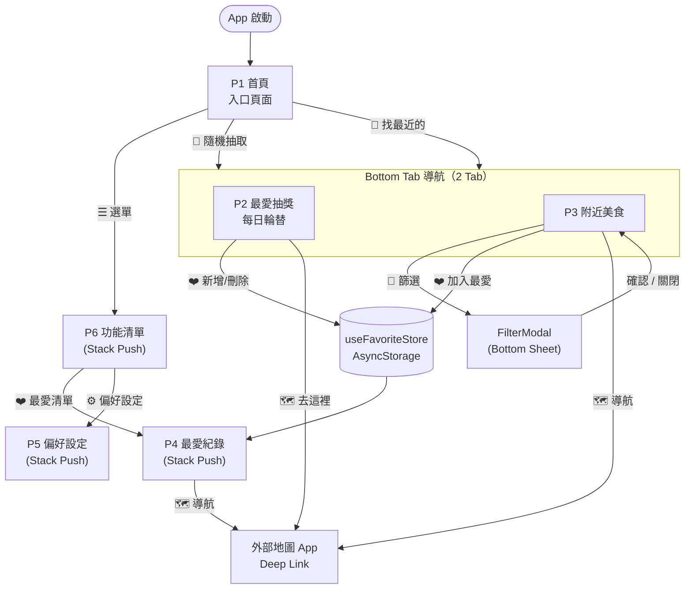
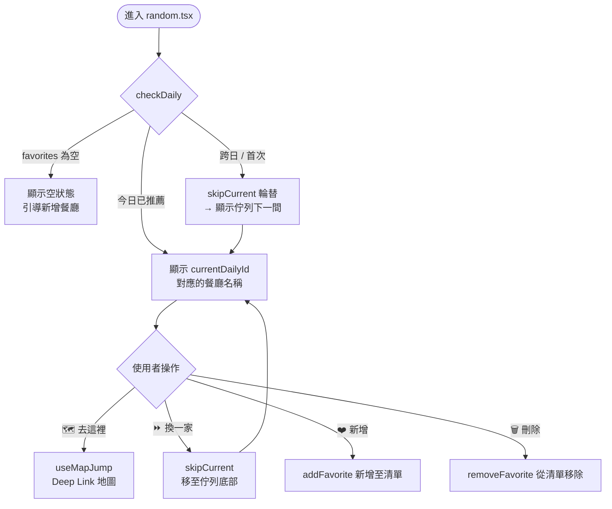
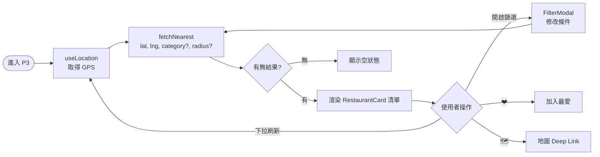

# 前端頁面架構書：「今天吃什麼」

> **文件版本**：v1.2 · 2026-03-20  
> **技術基礎**：Expo SDK 54 / React Native / Expo Router (File-based)  
> **參考文件**：[ARCHITECTURE.md](./ARCHITECTURE.md)

---

## 目錄

1. [頁面總覽與編號](#1-頁面總覽與編號)
2. [頁面詳細規格](#2-頁面詳細規格)
   - [P1 首頁：每日推薦盲盒](#p1-首頁每日推薦盲盒-appindextsx)
   - [P2 隨機抽餐廳](#p2-隨機抽餐廳-apptabsrandomtsx)
   - [P3 最近的餐廳](#p3-最近的餐廳-apptabsnearesttsx)
   - [P4 最愛餐廳紀錄](#p4-最愛餐廳紀錄-apptabsfavoritestsx)
   - [P5 偏好設定](#p5-偏好設定-appsettingsindextsx)
3. [頁面流程圖](#3-頁面流程圖)
4. [通用組件設計規範](#4-通用組件設計規範)
   - [按鈕樣式規範](#41-按鈕樣式規範)
   - [導航欄架構](#42-導航欄架構)
   - [通用卡片規範](#43-通用卡片規範)
5. [狀態與資料流對應](#5-狀態與資料流對應)

---

## 1. 頁面總覽與編號

| 編號 | 頁面名稱 | 路由路徑 | 類型 | 說明 |
|:---:|---|---|:---:|---|
| **P1** | 首頁 · 入口頁面 | `app/index.tsx` | Stack | App 啟動入口，提供「隨機抽取」與「找最近的」兩個入口按鈕，左上角 ☰ 導向功能清單 |
| **P2** | 最愛抽獎（每日輪替） | `app/(tabs)/random.tsx` | Tab | 從最愛清單中每日輪替推薦餐廳，支援新增、跳過、刪除 |
| **P3** | 附近美食 | `app/(tabs)/nearest.tsx` | Tab | 依 GPS + Google Places API 列出附近餐廳清單，支援分類篩選 |
| **P4** | 最愛餐廳紀錄 | `app/favorites.tsx` | Stack | 管理已加入最愛的餐廳清單，可排序、刪除 |
| **P5** | 偏好設定 | `app/settings.tsx` | Stack | 設定交通方式、最高交通時間、Google 帳號同步管理 |
| **P6** | 功能清單 | `app/menu.tsx` | Stack | 從首頁 ☰ 進入，列出「最愛清單」與「偏好設定」入口 |

> **說明**：P2–P3 為 Bottom Tab 導航內的頁面（2 個 Tab）；P1 為 Stack 根頁面；P4–P6 由各入口以 Stack Push 開啟。

---

## 2. 頁面詳細規格

---

### P1 首頁：每日推薦盲盒 `app/index.tsx`

**頁面定位**：App 的啟動入口頁面，提供兩個主要功能的快速入口按鈕，以及通往功能清單的 ☰ 選單。

#### 主要 UI 區塊

| 區塊 | 描述 |
|---|---|
| Header 左上 | ☰ 漢堡選單按鈕，導向 P6 功能清單 |
| Header 右上 | 👤 帳號 Avatar（已登入：彩色圓形首字母；未登入：灰色 person-outline），點擊導向 P5 設定 |
| 主視覺區域 | App 名稱 / Logo 展示 |
| 入口按鈕群 | 「隨機抽取」+ 「找最近的」兩個大型 CTA |

#### 按鈕清單與跳轉邏輯

| # | 按鈕名稱 | 樣式類型 | 動作 / 跳轉邏輯 |
|:---:|---|:---:|---|
| B1-1 | 🎲 **隨機抽取** | `primary` | Tab Navigate → 進入 **P2 最愛抽獎**（(tabs)/random.tsx） |
| B1-2 | 📍 **找最近的** | `primary` | Tab Navigate → 進入 **P3 附近美食**（(tabs)/nearest.tsx） |
| B1-3 | ☰ **功能清單**（Header 左上） | `icon` | Stack Push → 跳轉至 **P6 功能清單** |
| B1-4 | 👤 **帳號 Avatar**（Header 右上） | `icon` | Stack Push → 跳轉至 **P5 偏好設定**。已登入：顯示 primary 圓形 + 名字首字母；未登入：顯示灰色 outline 圓形 + person-outline |

#### 狀態判斷邏輯

```
App 啟動 → 直接顯示首頁入口
  └── 無條件分支，純粹的路由導航入口頁面
```

---

### P2 最愛抽獎（每日輪替） `app/(tabs)/random.tsx`

**頁面定位**：從使用者的最愛清單中，每日輪替推薦一間餐廳。支援 Google Places 搜尋新增、手動新增、分類篩選、跳過當前推薦、營業狀態查詢。資料完全來自本地 `useFavoriteStore`，營業狀態透過 Google Places API 即時查詢。

#### 主要 UI 區塊

| 區塊 | 描述 |
|---|---|
| 分類篩選 Chip 列 | 動態從 `favorites` 中提取所有不重複的 `category`，顯示「全部」+ 各分類 Chip。選擇後僅在該分類中輪替。無分類資料時隱藏 |
| 盲盒卡片（初始） | ❓ 大圖示 + 「按下抽獎來試試手氣」提示 + 「從你的 N 家最愛餐廳中隨機抽取」計數。進入頁面時預設顯示盲盒 |
| 今日推薦卡片（揭曉後） | 🍽️ Emoji + 餐廳名稱 + 分類 + 備註（若有）+ 地址（若有）+ 營業狀態 Badge |
| 營業狀態 Badge | 🟢 營業中 / 🔴 已打烊 / ❓ 無法確認營業狀態。揭曉後自動查詢 Google Places API |
| 已打烊提示 | 若餐廳已打烊，顯示「這家已打烊，要再換一家嗎？」警示列 |
| 操作按鈕列 | 「導航」按鈕（揭曉後）+ 「抽獎」按鈕（🎲 dice-outline 圖示）。第一次點擊「抽獎」揭曉盲盒；後續點擊輪替下一家 |
| AddModal | 三模式：「搜尋餐廳」（Google Places Text Search 搜尋 → 選取 → 靜態地圖預覽確認位置 → 確認新增，含地址/分類/placeId/經緯度）+「手動輸入」（僅名稱+備註）+「貼上連結」（Google Maps 分享 URL 解析 → 自動提取餐廳資訊 → 靜態地圖預覽 → 確認新增） |
| ListModal | 半螢幕 Modal：FlatList 顯示所有最愛餐廳，每項含分類標籤、地址、刪除按鈕，當前推薦項標記 🍽️ |
| 空狀態 | 🍽️ 大圖示 + 「還沒有最愛餐廳」+ 「先新增幾家愛吃的餐廳，系統會每天幫你排一家！」+ 新增 CTA |

#### 按鈕清單與跳轉邏輯

| # | 按鈕名稱 | 樣式類型 | 動作 / 跳轉邏輯 |
|:---:|---|:---:|---|
| B2-1 | 🎲 **抽獎** | `secondary` | 首次點擊：揭曉盲盒（`setIsRevealed(true)`）+ 查詢營業狀態。再次點擊：`skipCurrent()` 輪替 + 查詢下一家營業狀態。`disabled` 條件：已揭曉且 `filteredQueue.length <= 1` |
| B2-2 | 🗑️ **刪除**（ListModal 內每項） | `danger` | Alert 確認 → `removeFavorite(id)` |
| B2-3 | ➕ **新增最愛餐廳**（空狀態 CTA） | `primary` | 開啟 `AddModal`（搜尋模式或手動輸入） |
| B2-4 | 🧭 **導航**（揭曉後） | `primary` | 呼叫 `jumpToMap(address \|\| name, transportMode)` 開啟外部地圖 |
| B2-5 | 📋 **清單**（Header 右側） | `text` | `router.push('/favorites')` → 跳轉至 **P4 最愛餐廳紀錄** |

#### 狀態判斷邏輯

```
元件掛載 → useEffect → checkDaily()
  ├── favorites 為空        → 渲染空狀態（大圖示 + 新增 CTA）
  ├── filteredFavorites 為空（篩選無結果） → 顯示「此分類沒有餐廳」
  └── 有餐廳 → 顯示盲盒卡片（isRevealed = false）

「抽獎」按下：
  ├── 尚未揭曉 → 揭曉當前餐廳 + 查詢營業狀態
  └── 已揭曉   → 篩選後佇列輪替下一家 + 查詢營業狀態

新增成功後：Alert 提示 → 自動展開 ListModal
刪除成功後：自動呼叫 sanitizeCurrentId 修復孤兒佇列
```

---

### P3 最近的餐廳 `app/(tabs)/nearest.tsx`

**頁面定位**：以使用者 GPS 為中心，列出附近符合條件的餐廳清單，支援分類篩選。

#### 主要 UI 區塊

| 區塊 | 描述 |
|---|---|
| 搜尋列 / 篩選 Bar | 搜尋輸入框 + 分類標籤橫向滑動 |
| `FilterModal` | 半強制彈出的進階篩選（距離半徑、評分下限、分類）|
| 餐廳清單（`FlatList`） | `RestaurantCard` 列表，支援下拉刷新與無限滾動 |
| 空狀態 | 無結果時顯示提示文字 |

#### 按鈕清單與跳轉邏輯

| # | 按鈕名稱 | 樣式類型 | 動作 / 跳轉邏輯 |
|:---:|---|:---:|---|
| B3-1 | 🔽 **篩選**（Filter 按鈕） | `secondary` | 開啟 `FilterModal` 底部彈出層；確認後重新呼叫 `fetchNearest()` 更新清單 |
| B3-2 | ❤️ **加入最愛**（卡片內） | `icon` | 呼叫 `useFavoriteStore.addFavorite(restaurant)` |
| B3-3 | 🗺️ **導航**（卡片內） | `icon` | 呼叫 `useMapJump()` → Deep Link 地圖導航 |
| B3-4 | 🔄 **重新整理**（下拉） | — | `onRefresh` → `restaurantService.clearCache()` 清除快取 → 重新呼叫 `fetchNearest()` 取得最新資料 |

---

### P4 最愛餐廳紀錄 `app/favorites.tsx`

**頁面定位**：集中展示並管理使用者加入最愛的所有餐廳，提供排序、刪除與查看輪替佇列的能力。支援三種新增模式：Google Places 搜尋、手動輸入、貼上 Google Maps 連結。以 Stack Push 方式從 P6 功能清單進入，不在 Tab Bar 內。

#### 主要 UI 區塊

| 區塊 | 描述 |
|---|---|
| 佇列順序指示器 | 顯示當前輪替順序（今日 → 明日 → 後日…） |
| 最愛清單（可拖曳排序） | 含餐廳名稱、類別、加入時間，支援滑動刪除（Swipe-to-delete） |
| FAB 浮動按鈕 | 右下角 ➕ 浮動按鈕，開啟 AddModal |
| AddModal | 三模式：「搜尋餐廳」（Google Places Text Search 搜尋 → 選取 → 靜態地圖預覽確認位置 → 確認新增，含地址/分類/placeId/經緯度）+「手動輸入」（僅名稱+備註）+「貼上連結」（Google Maps 分享 URL 解析 → 自動提取餐廳資訊 → 靜態地圖預覽 → 確認新增） |
| 空狀態 | 引導至 P3 探索餐廳的 CTA + 手動新增 CTA |

#### 按鈕清單與跳轉邏輯

| # | 按鈕名稱 | 樣式類型 | 動作 / 跳轉邏輯 |
|:---:|---|:---:|---|
| B4-1 | ✏️ **編輯排序** | `text` | 進入拖曳排序模式；完成後更新 `useFavoriteStore` 的 `queue[]` 順序 |
| B4-2 | 🗑️ **刪除**（Swipe or 編輯模式） | `danger` | 呼叫 `useFavoriteStore.removeFavorite(id)` → 從清單與佇列移除 |
| B4-3 | 🗺️ **導航**（卡片內） | `icon` | 呼叫 `useMapJump()` → Deep Link 地圖導航 |
| B4-4 | ➕ **探索餐廳**（空狀態 CTA） | `primary` | Tab Switch → **P3 最近的餐廳** |
| B4-5 | ➕ **FAB 新增**（右下角浮動） | `primary` (FAB) | 開啟 `AddModal`（三模式：搜尋/手動/貼上連結） |
| B4-6 | ➕ **手動新增**（空狀態次要 CTA） | `secondary` | 開啟 `AddModal`（手動輸入模式） |

---

### P5 偏好設定 `app/settings.tsx`

**頁面定位**：使用者偏好設定頁面，包含 Google 雲端同步管理、交通方式切換與最高交通時間限制。以 Stack Push 方式從 P6 功能清單進入，不在 Tab Bar 中呈現。設定變更透過 Zustand `persist` 即時持久化，無需手動儲存。

#### 主要 UI 區塊

| 區塊 | 描述 |
|---|---|
| 自訂 Header | ← 返回按鈕 + 居中標題「偏好設定」（`fontSize: 17`, `fontWeight: '600'`） |
| ☁️ Google 雲端同步 | 帳號連結管理、同步狀態 Badge、自動同步 Toggle、手動同步按鈕、進階操作（拉取/推送） |
| 交通方式選擇器 | 三選一 Radio Card：🚶 走路 / 🚗 機車/開車 / 🚌 大眾運輸，含圓形圖示 + 勾選指示器 |
| 時間限制控制器 | ➖ / ➕ 按鈕 + 進度條視覺化，範圍 5–60 分鐘，步進 5 分鐘 |

#### 按鈕清單與跳轉邏輯

| # | 按鈕名稱 | 樣式類型 | 動作 / 跳轉邏輯 |
|:---:|---|:---:|---|
| B5-1 | 🚶 **走路** | `segmented` (Radio Card) | 更新 `useUserStore.transportMode = 'walk'` |
| B5-2 | 🚗 **機車/開車** | `segmented` (Radio Card) | 更新 `useUserStore.transportMode = 'drive'` |
| B5-3 | 🚌 **大眾運輸** | `segmented` (Radio Card) | 更新 `useUserStore.transportMode = 'transit'` |
| B5-4 | ← **返回**（Header） | `icon` | `router.back()` 回到上一頁 |
| B5-5 | 🔗 **連結 Google 帳號** | `primary` (Google 藍) | 呼叫 `useGoogleAuth.signIn()` → 完成 OAuth 授權 |
| B5-6 | 🔄 **立即同步** | `primary` | 呼叫 `useSyncOrchestrator.triggerSync()` → 上傳/下載資料 |
| B5-7 | ⬇️ **拉取雲端** | `secondary` | Alert 確認 → `pullFromCloud()` → 雲端資料覆蓋本地 |
| B5-8 | ⬆️ **推送雲端** | `secondary` | Alert 確認 → `uploadFavorites()` → 本地資料覆蓋雲端 |
| B5-9 | 🚪 **取消連結 Google** | `danger` (outline) | Alert 確認 → `signOut()` → 斷開 Google 授權 |
| B5-10 | 🔘 **自動同步 Toggle** | `switch` | 切換 `useSyncMetaStore.syncEnabled` |
| B5-11 | ➖ **減少時間** | `icon` (圓形) | `setMaxTimeMins(max - 5)`，`disabled` 條件：`<= 5` |
| B5-12 | ➕ **增加時間** | `icon` (圓形) | `setMaxTimeMins(max + 5)`，`disabled` 條件：`>= 60` |

#### 狀態判斷邏輯

```
進入頁面
  ├── Google OAuth 未設定 (.env 缺 CLIENT_ID) → 顯示「尚未設定」提示
  ├── 未登入 → 顯示推廣文案 + 特色列表 + 「連結 Google 帳號」CTA
  └── 已登入 → 顯示完整同步管理面板
       ├── 帳號資訊卡片（名稱 + Email + SyncBadge）
       ├── 同步詳情列（最後同步時間、本地餐廳數、同步版本、網路狀態）
       ├── pendingSync 為 true → 顯示「有未同步的變更」Badge
       ├── syncError 非空 → 顯示紅色錯誤提示框
       └── 進階操作區（拉取雲端 / 推送雲端 / 取消連結）
```

---

### P6 功能清單 `app/menu.tsx`

**頁面定位**：從首頁 ☰ 漢堡選單進入的功能入口頁面。以資料驅動的 `MenuItem[]` 陣列渲染選單項目，每項包含圖示、標題、描述與 chevron，以 Stack Push 開啟。

#### 主要 UI 區塊

| 區塊 | 描述 |
|---|---|
| Header 標題列 | 左側 ← 返回按鈕（回首頁）、中間標題「功能清單」 |
| 帳號狀態卡片 | 已登入：Avatar + 名稱 + Email + 同步狀態 Badge + 登出按鈕；未登入：「連結 Google 帳號」 CTA 卡片（導向 P5） |
| 選單項目列表 | 2 個 MenuItem 卡片：❤️ 最愛清單 / ⚙️ 偏好設定，每項含圖示、名稱、描述、→ chevron |
| Footer | 「今天吃什麼 v1.0」版本資訊，底部居中 |

#### 按鈕清單與跳轉邏輯

| # | 按鈕名稱 | 樣式類型 | 動作 / 跳轉邏輯 |
|:---:|---|:---:|---|
| B6-1 | ← **返回**（Header 左側） | `text` | `Link href="/"` → 返回 **P1 首頁** |
| B6-2 | ❤️ **最愛清單** | MenuItem | `Link href="/favorites"` → Stack Push 至 **P4 最愛餐廳紀錄** |
| B6-3 | ⚙️ **偏好設定** | MenuItem | `Link href="/settings"` → Stack Push 至 **P5 偏好設定** |
| B6-4 | 🚪 **登出**（帳號卡片內） | `danger` | Alert 確認 → `useGoogleAuth.signOut()` → 斷開 Google 授權。僅已登入時顯示 |
| B6-5 | ☁️ **連結 Google 帳號**（未登入 CTA） | CTA card | `Link href="/settings"` → 導向 P5 進行 Google 登入。僅未登入時顯示 |

#### MenuItem 視覺規範

```
┌─────────────────────────────────────────────┐
│  [Icon Box]  標題               →  chevron  │
│  (48×48 圓角)  描述文字                      │
└─────────────────────────────────────────────┘
```

- Icon Box：48×48px，`borderRadius: 14`，背景色為 `iconColor + '18'`（18% 透明度）
- MenuItem 按壓效果：背景色切換為 `theme.colors.background`
- 整體 padding：`vertical: 16, horizontal: 14`

---

## 3. 頁面流程圖

### 3.1 整體頁面導航流程



---

### 3.2 P2 最愛抽獎：每日輪替業務流程



---

### 3.3 P3 最近餐廳：搜尋與篩選流程



---

## 4. 通用組件設計規範

---

### 4.1 按鈕樣式規範

全站按鈕基於 `src/components/common/Button.tsx` 封裝，透過 `variant` prop 控制外觀，所有顏色值引用 `src/constants/theme.ts`。

#### Variant 類型定義

```typescript
type ButtonVariant =
  | 'primary'     // 主要行動按鈕（CTA）
  | 'secondary'   // 次要操作按鈕
  | 'danger'      // 破壞性操作（刪除）
  | 'text'        // 純文字按鈕（低強調）
  | 'icon'        // 僅圖示，無文字
  | 'segmented'   // 分段選擇器內的選項按鈕
```

#### 視覺規範表

| Variant | 背景色 | 文字色 | 邊框 | 使用場景 |
|:---:|---|---|---|---|
| `primary` | `theme.colors.primary` (橘/主色) | `white` | 無 | 去這裡、確認、再抽一次 |
| `secondary` | `transparent` | `theme.colors.primary` | 1px primary | 跳過、篩選、次要行動 |
| `danger` | `theme.colors.error` (紅) | `white` | 無 | 刪除最愛 |
| `text` | `transparent` | `theme.colors.textSecondary` | 無 | 最愛清單、Header 文字連結 |
| `icon` | `transparent` | `theme.colors.text` | 無 | Header 圖示、卡片內圖示操作 |
| `segmented` | 選中：primary；未選：`surface` | 對應前景色 | 統一外框 | 交通方式切換 |

#### 尺寸規範

| Size | height | paddingHorizontal | fontSize | 使用場景 |
|:---:|---|---|---|---|
| `lg` | 52px | 24px | 16px | 全寬 CTA（去這裡、再抽一次）|
| `md` | 44px | 20px | 14px | 標準按鈕（跳過、儲存設定）|
| `sm` | 36px | 14px | 13px | 卡片內次要操作 |
| `icon` | 40px | 10px | — | 圖示按鈕（正方形）|

#### Button.tsx Props 介面

```typescript
interface ButtonProps {
  label?: string;           // 按鈕文字（icon variant 可省略）
  onPress: () => void;
  variant?: ButtonVariant;  // 預設 'primary'
  size?: 'sm' | 'md' | 'lg' | 'icon'; // 預設 'md'
  icon?: React.ReactNode;   // 選填：左側圖示
  disabled?: boolean;
  loading?: boolean;        // 顯示 ActivityIndicator 取代文字
  fullWidth?: boolean;      // 是否撐滿父容器寬度
  active?: boolean;         // segmented variant 的選中狀態
  accessibilityLabel?: string;
}
```

#### 通用行為規範

- **圓角**：使用 `theme.borderRadius.md`（12px）；`icon` variant 使用 `theme.borderRadius.full`（圓形）。
- **陰影**：`primary` variant 加入輕微陰影（`theme.shadows.sm`, `elevation: 2`）提升層次感。
- **Press 狀態**：使用 `Pressable` + `opacity: 0.7`（`theme.interaction.pressedOpacity`）作為按下回饋。
- **Disabled 狀態**：透明度降低至 `0.4`，禁止 `onPress` 事件。
- **Loading 狀態**：以 `ActivityIndicator`（文字色）取代文字，同時禁止 `onPress`。
- **Accessibility**：自動設定 `accessibilityRole="button"` 與 `accessibilityState`。

---

### 4.2 導航欄架構

#### Bottom Tab Bar（`app/(tabs)/_layout.tsx`）

| Tab 順序 | 頁面 | 圖示（建議） | Tab Label |
|:---:|---|---|---|
| 1 | P2 最愛抽獎 `random.tsx` | 📅 `calendar-outline` | 抽獎 |
| 2 | P3 附近美食 `nearest.tsx` | 📍 `location-outline` | 附近 |

**Tab Bar 視覺規範**：

```typescript
// app/(tabs)/_layout.tsx 設定參考
screenOptions={{
  tabBarActiveTintColor: theme.colors.primary,
  tabBarInactiveTintColor: theme.colors.textSecondary,
  tabBarStyle: {
    backgroundColor: theme.colors.surface,
    borderTopColor: theme.colors.border,
    height: 80,
    paddingBottom: 12,
    paddingTop: 8,
  },
  tabBarLabelStyle: {
    ...theme.typography.bodySmall,
    fontWeight: '600',
    fontSize: 15,
  },
  headerShown: false,         // 各 Tab 頁面自管 Header
}}
```

#### Stack Header（`app/settings/_layout.tsx`）

**P5 偏好設定**以 Stack 方式呈現，Header 規範如下：

| 元素 | 規範 |
|---|---|
| 返回按鈕 | 系統預設 `←` 箭頭，顯示「返回」文字 |
| 標題 | 「偏好設定」，居中，`fontSize: 17`，`fontWeight: '600'` |
| 背景色 | `theme.colors.surface` |
| 右側選項 | 無（儲存由頁面內按鈕處理）|

---

### 4.3 通用卡片規範（`RestaurantCard.tsx`）

`RestaurantCard` 為最愛紀錄、隨機結果、附近清單共用的展示元件。

#### Props 介面

```typescript
interface RestaurantCardProps {
  restaurant: Restaurant;       // 資料模型（見 types/models.d.ts）
  onNavigate: () => void;       // 🗺️ 導航按鈕回調
  onToggleFavorite: () => void; // ❤️ 最愛 Toggle 回調
  isFavorite: boolean;          // 控制愛心圖示狀態
  showQueue?: boolean;          // P4 才需顯示佇列順序號碼
}
```

#### 卡片結構

```
┌─────────────────────────────────┐
│  [佇列號碼]  餐廳名稱       ❤️  │  ← 最愛 Icon（Toggle）
│             分類 · ⭐ 評分      │
│─────────────────────────────────│
│  📍 距離 xxx m                  │
│  🚶/🚗/🚌 預估交通時間 xx 分    │
│─────────────────────────────────│
│               [🗺️ 導航]        │  ← secondary variant, sm
└─────────────────────────────────┘
```

---

## 5. 狀態與資料流對應

| 頁面 | 讀取 Store | 調用 Hook | Service |
|---|---|---|---|
| P1 首頁 | `useGoogleAuthStore`（isSignedIn, user） | — | — |
| P2 最愛抽獎 | `useFavoriteStore`（currentDailyId, queue, favorites）| `useMapJump` | — |
| P3 附近美食 | `useUserStore`（transportMode, maxTimeMins）| `useLocation`、`useRestaurant.fetchNearest`、`useMapJump`、`useFavoriteStore.add` | `restaurant.getNearest` |
| P4 最愛紀錄 | `useFavoriteStore`（favorites, queue）| `useMapJump` | — |
| P5 設定 | `useUserStore`、`useGoogleAuthStore`、`useSyncMetaStore` | `useGoogleAuth`、`performSync`、`pullFromCloud` | — |
| P6 功能清單 | `useGoogleAuthStore`（isSignedIn, user）、`useSyncMetaStore`（syncStatus） | `useGoogleAuth`（signOut） | — |

---

*文件由 Antigravity AI 輔助生成，請隨功能迭代同步更新。*
