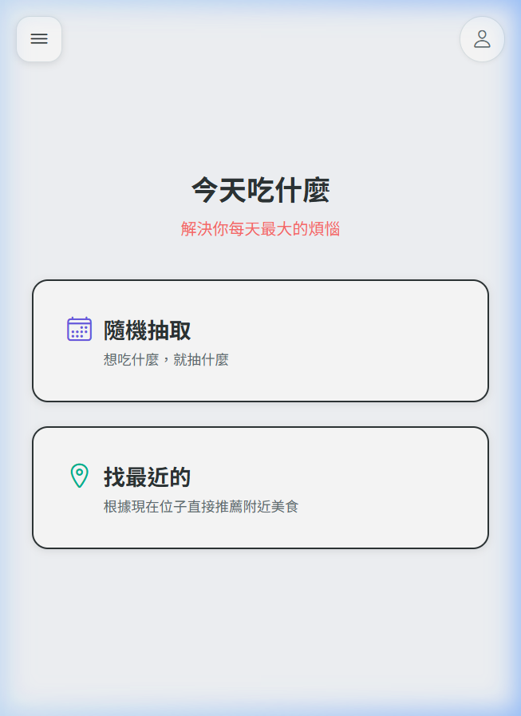
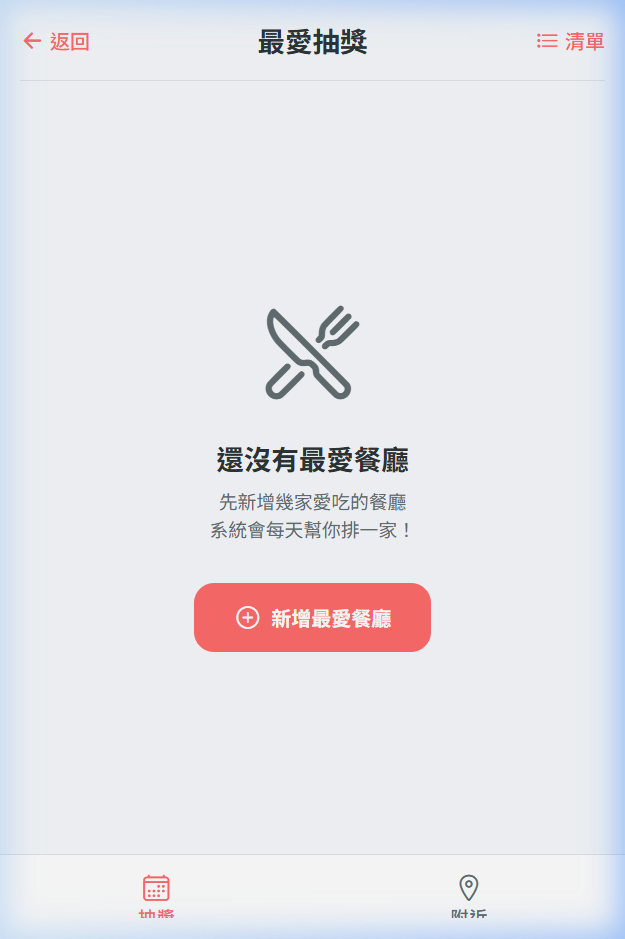
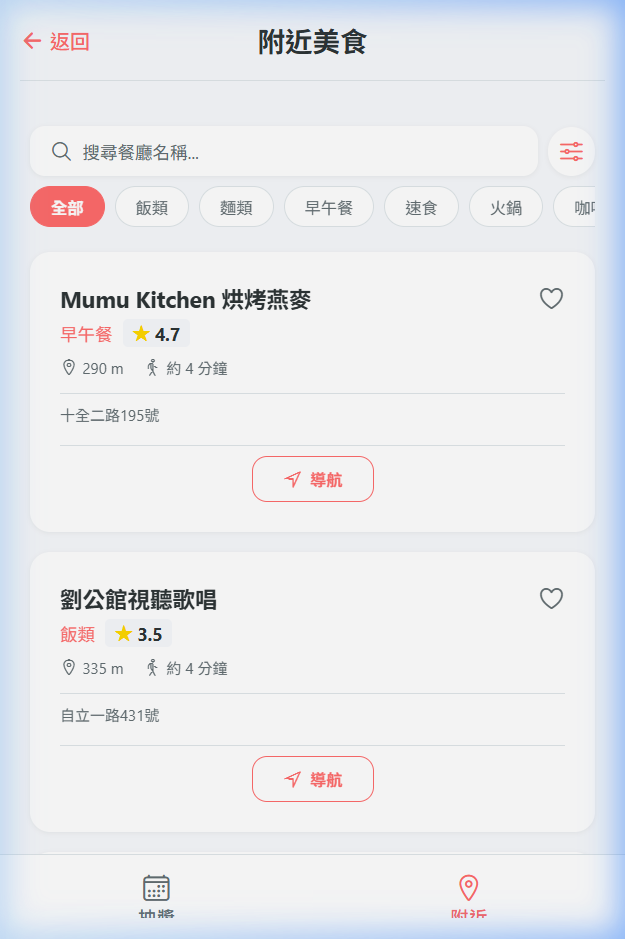
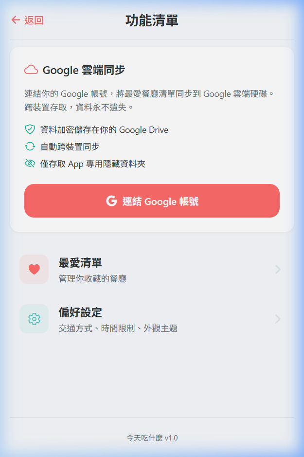
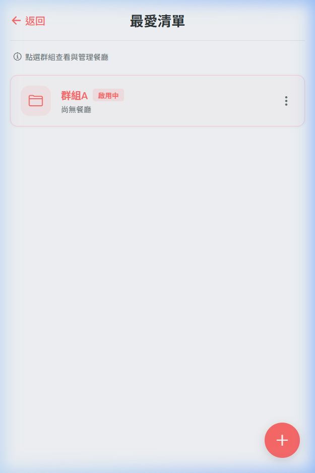
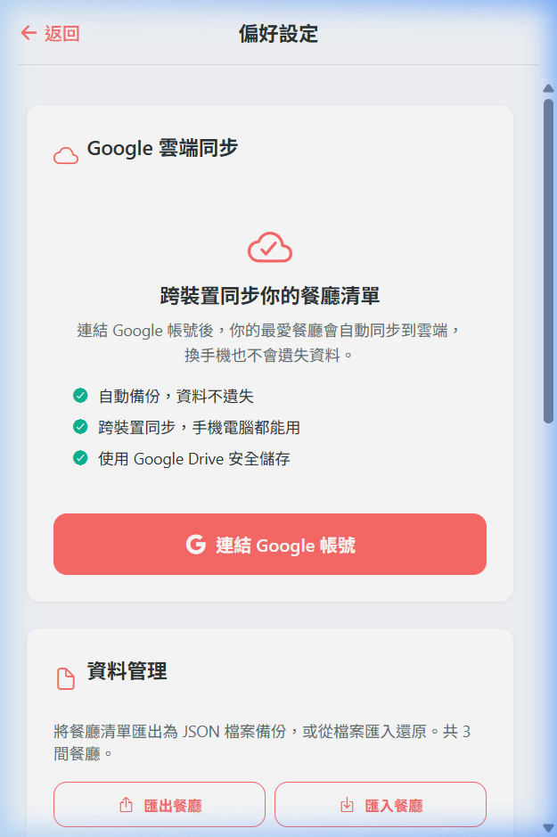

<div align="center">

# 🍽️ 今天吃什麼 — How-to-eat

### 每天最大的煩惱，交給我來解決

一款幫你決定「今天吃什麼」的行動應用程式。  
每日從最愛清單隨機推薦餐廳，讓選擇困難症成為過去式。

[](https://reactnative.dev/)
[](https://expo.dev/)
[](https://www.typescriptlang.org/)
[](./LICENSE)
[](https://makeapullrequest.com)

</div>

---

## 📸 App 截圖

<div align="center">
<table>
  <tr>
    <td align="center"><b>🏠 首頁</b></td>
    <td align="center"><b>🎲 最愛抽獎</b></td>
    <td align="center"><b>📍 附近美食</b></td>
  </tr>
  <tr>
    <td></td>
    <td></td>
    <td></td>
  </tr>
  <tr>
    <td align="center"><b>📋 功能清單</b></td>
    <td align="center"><b>❤️ 最愛清單</b></td>
    <td align="center"><b>⚙️ 偏好設定</b></td>
  </tr>
  <tr>
    <td></td>
    <td></td>
    <td></td>
  </tr>
</table>
</div>

---

## ✨ Features

| 功能 | 說明 |
|------|------|
| 🎲 **盲盒抽獎** | 從最愛清單中每日輪替推薦一間餐廳，選擇困難症救星 |
| 📍 **附近美食** | GPS 定位 + 分類篩選，即時搜尋附近餐廳 |
| ❤️ **最愛群組** | 多群組管理收藏餐廳，支援拖曳排序與滑動刪除 |
| ☁️ **雲端同步** | Google Drive 自動同步，跨裝置無縫切換 |
| 🗺️ **一鍵導航** | 直接開啟 Google Maps 導航到餐廳 |
| 🌓 **雙主題** | Light / Dark Mode 自動跟隨系統 |
| 📤 **匯出匯入** | JSON 格式備份還原，離線也能用 |
| 🔒 **隱私優先** | Local-First 架構，資料存在你的裝置 |

---

## 🏗️ 技術架構

```
Local-First + Serverless（零後端成本）
```

| 層級 | 技術 |
|------|------|
| **框架** | React Native + Expo SDK 54 |
| **路由** | Expo Router（File-based routing） |
| **語言** | TypeScript（嚴格模式） |
| **狀態管理** | Zustand + persist middleware → AsyncStorage |
| **附近搜尋** | Google Places API (New) — Nearby Search |
| **雲端同步** | Google Drive REST API v3（appDataFolder） |
| **認證** | Google OAuth 2.0（expo-auth-session + PKCE） |
| **動畫** | react-native-reanimated + gesture-handler |
| **設計系統** | 統一 Design Token（Light/Dark 雙主題） |

### 架構亮點

- 🧩 **Slices Pattern** — Store 拆分為 3 個獨立 Slice，職責分明
- 🔄 **LWW 合併策略** — Last-Write-Wins per-item 衝突解決
- 🛡️ **韌性 Fetch** — 指數退避 + Rate Limit + 自動 Auth 重新整理
- 📄 **三份架構文件** — [ARCHITECTURE.md](./ARCHITECTURE.md) / [PAGE_SPEC.md](./PAGE_SPEC.md) / [SYNC_ARCHITECTURE.md](./SYNC_ARCHITECTURE.md)

---

## 🚀 快速開始

### 環境需求

- Node.js 18+
- npm 9+
- Expo CLI（`npx expo`）

### 安裝與啟動

```bash
# 1. Clone 專案
git clone https://github.com/ying0215/How-to-eat.git
cd How-to-eat/mobile

# 2. 安裝依賴
npm install

# 3. 建立環境變數（選填）
cp .env.example .env
# 編輯 .env 填入 Google API Key 與 Client ID

# 4. 啟動開發伺服器
npx expo start
```

> 💡 **即使不設定任何環境變數**，App 也可正常運行（Mock 模式 + 本地存儲）。

### 環境變數

| 變數名稱 | 說明 | 必要 |
|----------|------|:---:|
| `EXPO_PUBLIC_GOOGLE_PLACES_API_KEY` | Google Places API Key（附近餐廳搜尋） | 否 |
| `EXPO_PUBLIC_GOOGLE_CLIENT_ID` | Google OAuth 2.0 Client ID（雲端同步） | 否 |
| `EXPO_PUBLIC_GOOGLE_MAPS_SCHEME` | Google Maps URL Scheme | 否 |

---

## 🧪 測試

```bash
# 執行所有測試
npx jest --forceExit

# 執行特定模組測試
npx jest useFavoriteStore --forceExit
```

涵蓋 **17+ 測試檔案**，覆蓋範圍：

| 類別 | 測試範圍 |
|------|----------|
| 🏪 Store | 最愛管理 CRUD、群組操作、跨日輪替 |
| 🔄 Sync | LWW 合併、Drive API CRUD、E2E 多裝置同步 |
| 🌐 Service | 餐廳搜尋（API/Mock 雙模式）、快取、降級 |
| 🔗 Hook | 網路偵測、餐廳查詢、韌性 Fetch |
| 📦 Utils | URL 解析、匯出匯入、批次處理 |

---

## 📁 專案結構

```
mobile/
├── app/                    # 頁面層（Expo Router file-based）
│   ├── index.tsx           # 首頁入口
│   ├── menu.tsx            # 功能清單
│   ├── settings.tsx        # 偏好設定
│   ├── (tabs)/             # Tab 導航
│   │   ├── random.tsx      # 🎲 最愛抽獎
│   │   └── nearest.tsx     # 📍 附近美食
│   └── favorites/          # ❤️ 最愛清單（Nested Stack）
│       ├── index.tsx       # 群組列表
│       └── [groupId].tsx   # 群組詳情
├── src/
│   ├── auth/               # Google OAuth 認證
│   ├── sync/               # Google Drive 同步
│   ├── store/              # Zustand 狀態管理（Slices Pattern）
│   ├── hooks/              # 業務邏輯 Hook
│   ├── services/           # 資料存取層
│   ├── components/         # UI 元件（common/ + features/）
│   ├── constants/          # Design Token + 分類常數
│   ├── types/              # TypeScript 型別定義
│   └── utils/              # 工具函式
├── ARCHITECTURE.md          # 系統架構文件
├── PAGE_SPEC.md             # 前端 UI 規格書
└── SYNC_ARCHITECTURE.md     # 雲端同步架構書
```

---

## 🤝 Contributing

歡迎各種形式的貢獻！請參考我們的 Issue 模板提交 Bug 或功能建議。

1. Fork 這個專案
2. 建立你的 Feature Branch（`git checkout -b feature/amazing-feature`）
3. Commit 你的修改（`git commit -m 'Add amazing feature'`）
4. Push 到 Branch（`git push origin feature/amazing-feature`）
5. 開啟 Pull Request

---

## 📄 License

本專案採用 [MIT License](./LICENSE) 授權 — 你可以自由使用、修改和分發。

---

<div align="center">

**⭐ 如果這個專案對你有幫助，歡迎給顆 Star！**

Made with ❤️ and 🍜

</div>
