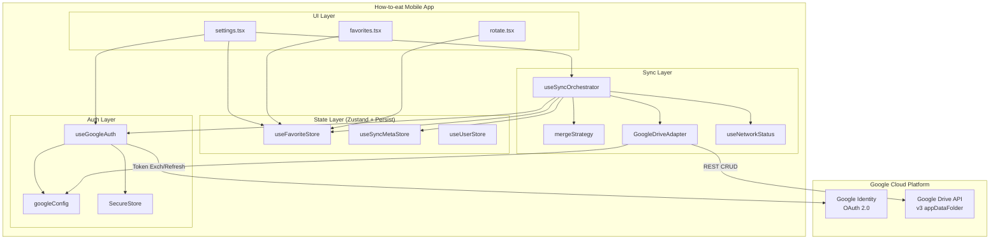
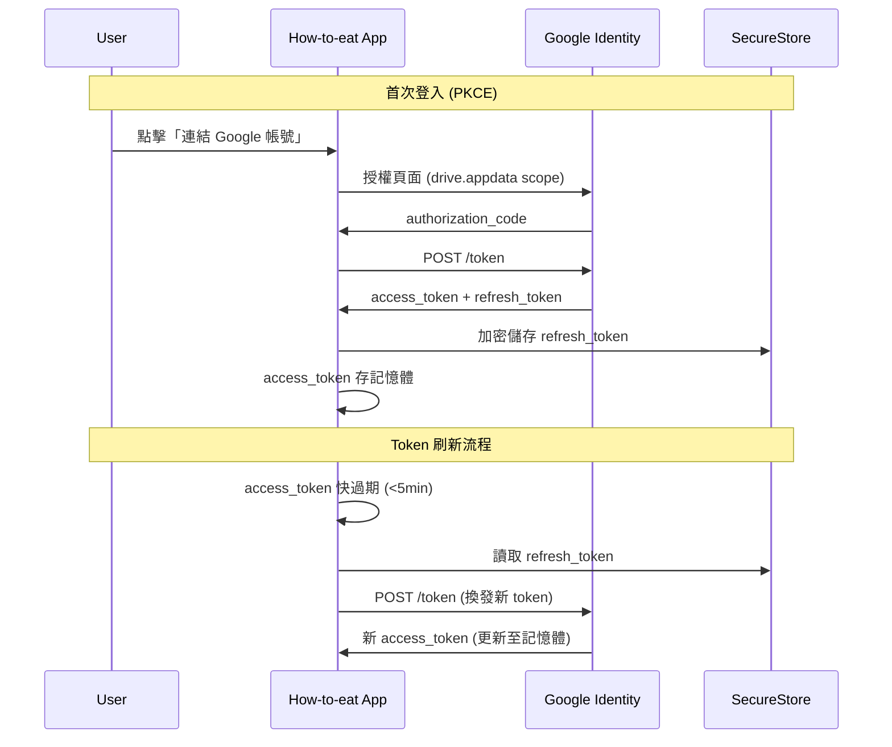
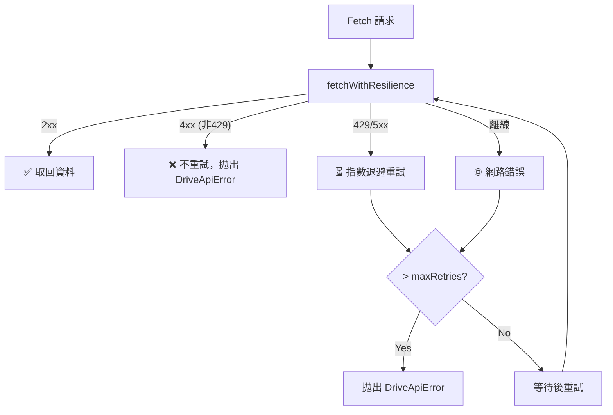
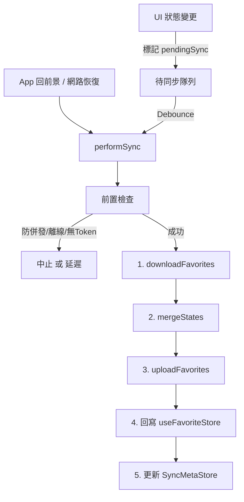
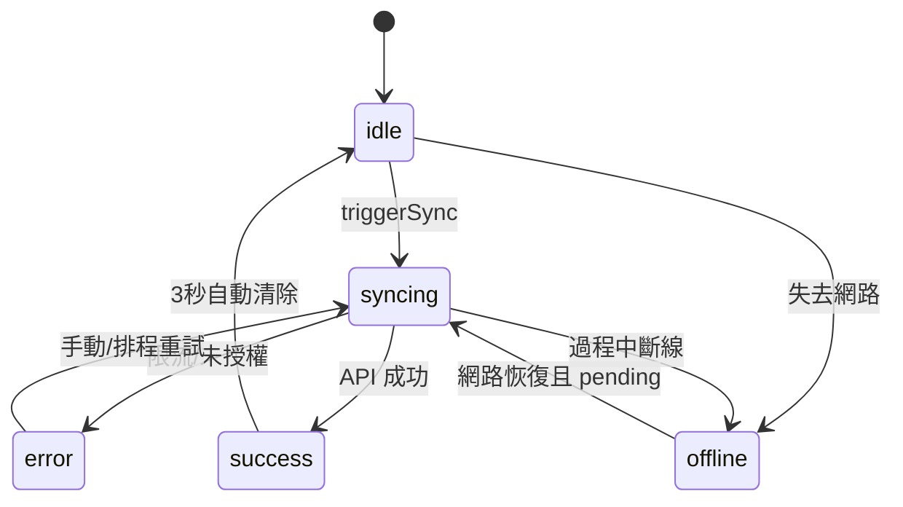

---
# ──── Project Metadata ────
project: How-to-eat
description: 雲端同步架構書：Google Drive Sync Layer
architecture: Local-First + Serverless
platform: React Native (Expo)
language: TypeScript
routing: Expo Router
state: Zustand + AsyncStorage
auth: Google OAuth 2.0 (PKCE)

# ──── Persistence Keys ────
storage_keys:
  - key: "how-to-eat-favorites.json"
    store: Google Drive appDataFolder
    content: "SyncableFavoriteState (餐廳清單、輪替佇列與 metadata)"
  - key: "favorite-restaurant-storage"
    store: AsyncStorage
    content: "FavoriteStore 狀態"
  - key: "sync-meta-storage"
    store: AsyncStorage
    content: "SyncMetaStore 狀態"
  - key: "user-preferences-storage"
    store: AsyncStorage
    content: "使用者偏好設定 (transportMode, maxTimeMins, themeMode)"

# ──── Env Variables ────
env:
  EXPO_PUBLIC_GOOGLE_CLIENT_ID: "Google OAuth Client ID"

# ──── SSOT 邊界 ────
ssot:
  - 本文件為 Google Drive 同步機制與 Auth 流程的單一真相源 (SSOT)。
  - 若與 ARCHITECTURE.md 重疊，關於 Sync / Auth 的實作細節以本文件為準。
---

# 雲端同步架構書：Google Drive Sync Layer

> **重要說明**：本專案為 **Local-First + Serverless** 架構，無自建後端伺服器。所有雲端儲存與使用者認證均由 Google 平台級服務提供。

## Rules
- **最小權限**：OAuth scope 僅 `drive.appdata`，無法讀寫使用者的常規 Drive 檔案。
- **離線容錯**：網路斷線時標記 `pendingSync`，待連線恢復後自動消耗佇列。
- **延遲同步**：UI 操作非阻塞，透過 debounce 延遲呼叫，降低網路請求與電量消耗。
- **衝突安全**：採用 LWW (Last-Write-Wins) per-item 合併策略，刪除操作使用 `tombstone` 機制，7 天內確保跨裝置傳播。
- **Token 安全**：Access token 僅存記憶體，Refresh token 存入 `expo-secure-store` 進行加密保存。

## 1. 架構總覽

### 1.1 系統架構流



## 2. File Registry（檔案登記簿）

### `src/auth/`
| 檔案 | 職責 | 暴露 API | 依賴 |
|------|------|----------|------|
| `googleConfig.ts` | 定義 OAuth 與 API URL 常數 | `googleClientId`, `GOOGLE_DRIVE_SCOPES`, `isGoogleConfigured()` | `.env` |
| `useGoogleAuth.ts` | OAuth 生命週期管理 (PKCE) | `signIn()`, `signOut()`, `getValidToken()`, `user`, `isSignedIn` | `expo-auth-session`, `expo-secure-store` |

### `src/sync/`
| 檔案 | 職責 | 暴露 API | 依賴 |
|------|------|----------|------|
| `GoogleDriveAdapter.ts` | Google Drive API 封裝(CRUD) | `findFavoritesFile()`, `downloadFavorites()`, `uploadFavorites()`, `deleteFavoritesFile()` | `fetchWithResilience` |
| `mergeStrategy.ts` | LWW 衝突解決核心邏輯 | `mergeStates()`, `upgradeToSyncable()`, `downgradeFromSyncable()` | — |
| `useSyncOrchestrator.ts` | 同步排程、 debounce 及 Sync Meta State | `performSync()`, `triggerSync()`, `syncStatus` | `GoogleDriveAdapter`, `mergeStrategy`, `useFavoriteStore`, `useNetworkStatus` |

### `src/hooks/`
| 檔案 | 職責 | 暴露 API | 依賴 |
|------|------|----------|------|
| `useNetworkStatus.ts` | 跨平台連線偵測 (Web 事件 / Native long-polling) | `isConnected`, `isChecking`, `checkNetwork()` | `fetch` |

### `src/store/`
| 檔案 | 職責 | 暴露 API | 依賴 |
|------|------|----------|------|
| `useFavoriteStore.ts` | 核心餐廳清單、輪替與狀態操作 | `addFavorite()`, `removeFavorite()`, `updateFavoriteNote()` | `@react-native-async-storage/async-storage` |

## 3. Auth Layer — Google OAuth 2.0



## 4. Cloud Layer 與 Merge Layer

### 4.1 雲端狀態介面 (Data Schema)

```typescript
// ═══ SyncableFavoriteState ═══
// persist → Google Drive appDataFolder (how-to-eat-favorites.json)
interface SyncableFavoriteState {
  // ── State ──
  favorites: SyncableFavorite[]    // 所有餐廳 (包含軟刪除的墓碑紀錄)
  groups: SyncableGroup[]          // 所有群組 (包含 tombstone)
  activeGroupId: string            // 啟用中的群組
  groupQueues: Record<groupId, string[]>          // 各群組輪替佇列
  groupCurrentDailyIds: Record<groupId, string | null> // 各群組今日推薦
  lastUpdateDate: string           // YYYY-MM-DD
  
  // ── Sync Metadata ──
  _syncVersion: number             // 單調遞增，每次變更 +1
  _lastSyncedAt: string            // ISO 時間戳
  _deviceId: string                // 本裝置 ID
}

interface SyncableFavorite {
  id: string
  name: string
  note?: string
  address?: string
  category?: string
  placeId?: string
  latitude?: number
  longitude?: number
  groupId: string                  // 所屬群組
  createdAt: string
  updatedAt: string                // 取最新時間 (LWW)
  isDeleted: boolean               // tombstone 標記
}

interface SyncableGroup {
  id: string
  name: string
  createdAt: string
  updatedAt: string
  isDeleted: boolean               // tombstone 標記
}
```

### 4.2 LWW 衝突合併策略 (Merge Layer)

- **新增/保留**：本地和遠端交集時取 `updatedAt` 較新者。
- **軟刪除 (Tombstone)**：以 `isDeleted = true` 及最新的 `updatedAt` 保留，期限 7 天內參與合併以傳播至其他裝置，超時自動銷毀。
- **向後相容 (Backward Compatibility)**：若偵測到遠端資料為舊版（無 `groups` 或 `groupQueues` 結構），合併層會自動將舊版的 `favorites`、`queue` 與 `currentDailyId` 對應並遷移至本地目前的 `activeGroupId`（或第一個可用群組），確保資料平滑升級不遺失。

### 4.3 Resilience Network Flow



## 5. Sync Orchestrator

### 5.1 同步控制流程



### 5.2 狀態機 (Sync meta)



## 6. State Layer — 資料模型

```typescript
// ═══ FavoriteState ═══
// persist → AsyncStorage["favorite-restaurant-storage"]
// Slices Pattern: createFavoriteSlice + createGroupSlice + createQueueSlice
interface FavoriteState {
    // ── State ──
    favorites: FavoriteRestaurant[]                    // 僅包含存活餐廳 (已剔除 tombstone)
    groups: FavoriteGroup[]                            // 最多 MAX_GROUPS=10 個群組
    activeGroupId: string                              // 啟用中的群組 ID
    groupQueues: Record<groupId, string[]>             // 各群組輪替佇列
    groupCurrentDailyIds: Record<groupId, string|null> // 各群組今日推薦
    lastUpdateDate: string                             // YYYY-MM-DD
    _deletedFavoriteIds: DeletedItemRecord[]            // tombstone 用（{id, deletedAt}）
    _deletedGroupIds: DeletedItemRecord[]               // tombstone 用

    // ── Actions (Slices) ──
    addFavorite(name: string, note?: string, extra?: {...}): void
    removeFavorite(id: string): void
    updateFavoriteName(id: string, name: string): void
    updateFavoriteNote(id: string, note: string): void
    createGroup(name?: string): FavoriteGroup | null
    renameGroup(id: string, name: string): void
    deleteGroup(id: string): boolean
    setActiveGroup(id: string): void
    skipCurrent(): void
    checkDaily(): void
    reorderQueue(newOrder: string[]): void
    findDuplicate(name: string, placeId?: string): FavoriteRestaurant | null
}
```

## 7. 未來深化方向

- **E2E 測試**: 串接真實帳號完整驗證同步。
- **端到端加密**: 採用 AES 加密 `SyncableFavoriteState`，保障雲端資料完全不透明。
- **衝突解決 UI**: 當 LWW 合併產生衝突時，提供使用者手動選擇的介面。
- **同步歷史紀錄**: 記錄近 N 次同步事件，提供診斷與回滾能力。

---

*Last updated: 2026-03-24*
