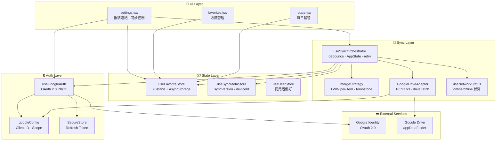
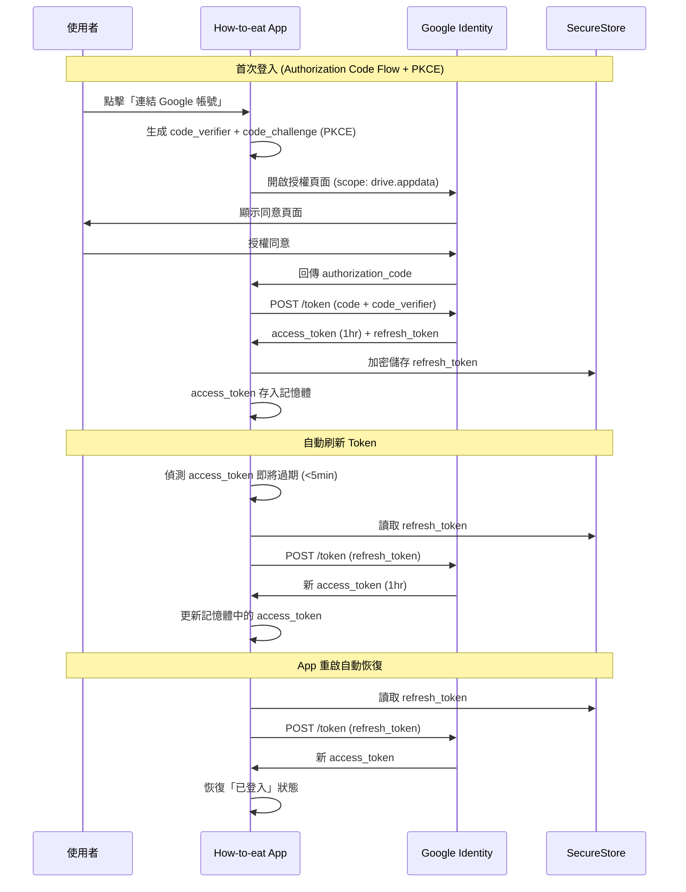
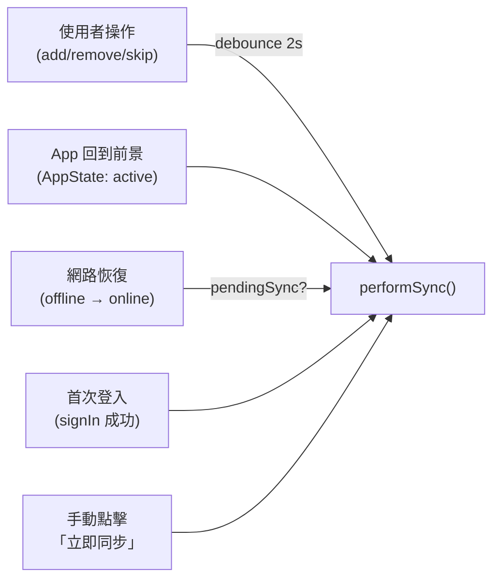
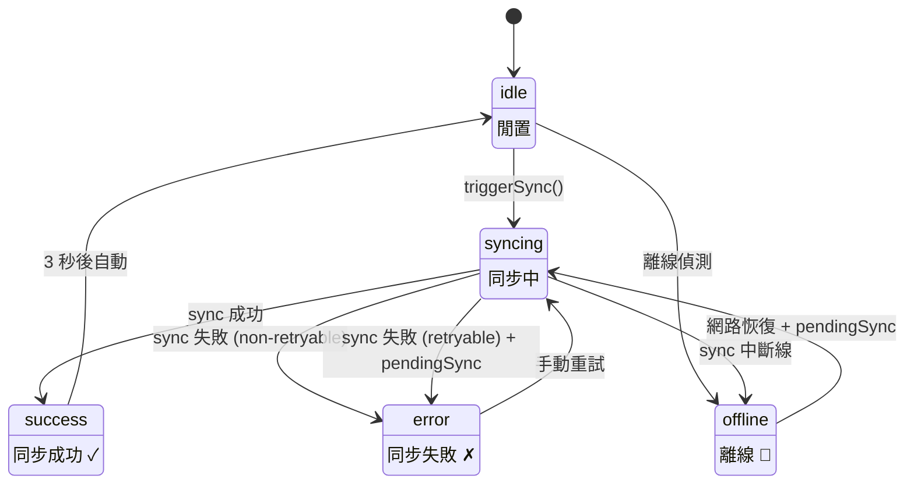

# 雲端同步架構書：Google Drive Sync Layer（方案 A）

> **文件版本**：v1.1 · 2026-03-19  
> **參考文件**：[ARCHITECTURE.md](./ARCHITECTURE.md)  
> **架構決策**：採用 Google Drive REST API v3 `appDataFolder` 作為唯一雲端後端，不需自建伺服器。  
> **重要說明**：本專案為 **Local-First + Serverless** 架構，無自建後端伺服器。本文件描述的是 App 內部的雲端同步模組（`mobile/src/sync/`、`mobile/src/auth/`），而非獨立部署的後端服務。

---

## 目錄

1. [架構總覽](#1-架構總覽)
2. [檔案清單與模組職責](#2-檔案清單與模組職責)
3. [Auth Layer — Google OAuth 2.0](#3-auth-layer--google-oauth-20)
4. [Cloud Layer — Google Drive Adapter](#4-cloud-layer--google-drive-adapter)
5. [Merge Layer — 衝突解決引擎](#5-merge-layer--衝突解決引擎)
6. [Sync Orchestrator — 同步排程器](#6-sync-orchestrator--同步排程器)
7. [Network Layer — 連線偵測](#7-network-layer--連線偵測)
8. [State Layer — 資料模型](#8-state-layer--資料模型)
9. [環境設定與前置需求](#9-環境設定與前置需求)
10. [安全性設計](#10-安全性設計)
11. [測試架構](#11-測試架構)
12. [未來深化建議](#12-未來深化建議)

---

## 1. 架構總覽

### 1.1 設計哲學

本應用採用 **Local-First + Serverless Cloud Sync** 架構。使用者的所有操作即時寫入本地（零延遲），雲端同步為非阻塞的背景任務。不需要自建後端伺服器——所有雲端儲存與使用者認證均由 Google 平台級服務提供。

| 設計原則 | 實踐 |
|----------|------|
| **Local-First** | 所有 UI 操作即時寫入 Zustand → AsyncStorage，不受網路影響 |
| **Serverless** | Google Drive `appDataFolder` 取代自建後端，零維運成本 |
| **最小權限** | OAuth scope 僅 `drive.appdata`，無法讀到使用者的任何 Drive 檔案 |
| **離線容錯** | 離線時自動標記 `pendingSync`，上線後自動消化待處理佇列 |
| **衝突安全** | LWW per-item merge + tombstone 軟刪除，跨裝置資料不遺失 |

### 1.2 系統架構圖

```
                           ┌──────────────────────────────────────────────────┐
                           │                Google Cloud Platform             │
                           │                                                  │
                           │  ┌────────────────┐    ┌─────────────────────┐  │
                           │  │ Google Identity │    │  Google Drive API   │  │
                           │  │    (OAuth 2.0)  │    │  v3 appDataFolder   │  │
                           │  └───────▲─────▲──┘    └──────▲──────▲───────┘  │
                           └──────────│─────│──────────────│──────│──────────┘
                                      │     │              │      │
                          ┌───────────┘     └──────┐  ┌───┘      └──────┐
                  Token Exchange     Token Refresh  │  Download     Upload
                    (PKCE)           (auto)         │  (GET)        (PATCH/POST)
                          │                │        │                │
  ┌───────────────────────┴────────────────┴────────┴────────────────┴──────┐
  │                          How-to-eat Mobile App                          │
  │                                                                         │
  │  ┌─────────────────────────────── UI Layer ──────────────────────────┐  │
  │  │  settings.tsx         favorites.tsx         rotate.tsx            │  │
  │  │  (帳號連結/同步控制)   (收藏管理)            (每日輪替)            │  │
  │  └─────────────────────────────────┬────────────────────────────────┘  │
  │                                    │                                    │
  │  ┌─────────────────── State Layer (Zustand + Persist) ──────────────┐  │
  │  │  useFavoriteStore          useSyncMetaStore        useUserStore   │  │
  │  │  (餐廳清單 + 佇列)        (同步 metadata)         (使用者偏好)    │  │
  │  │         │                        │                                │  │
  │  │         └────────────────────────┤                                │  │
  │  │              AsyncStorage (持久化)                                 │  │
  │  └──────────────────────────────────┬───────────────────────────────┘  │
  │                                     │                                   │
  │  ┌──────────────── Sync Layer (同步引擎) ───────────────────────────┐  │
  │  │  useSyncOrchestrator    mergeStrategy     GoogleDriveAdapter     │  │
  │  │  (排程/debounce/retry)  (LWW 合併)        (REST API 封裝)        │  │
  │  │         │                    │                    │               │  │
  │  │  useNetworkStatus ──────────┘                    │               │  │
  │  │  (連線偵測)                                       │               │  │
  │  └──────────────────────────────────────────────────┘               │  │
  │                                                                     │  │
  │  ┌────────────────────── Auth Layer ────────────────────────────────┐  │
  │  │  useGoogleAuth          googleConfig            SecureStore      │  │
  │  │  (OAuth 生命週期)       (Client ID / Scope)     (Refresh Token)  │  │
  │  └─────────────────────────────────────────────────────────────────┘  │
  └─────────────────────────────────────────────────────────────────────────┘
```

### 1.3 Mermaid 模組依賴圖



---

## 2. 檔案清單與模組職責

### 2.1 完整檔案對照表

| Layer | 檔案路徑 | 行數 | 職責 |
|-------|----------|------|------|
| **Auth** | `src/auth/googleConfig.ts` | 91 | OAuth Client ID、Scope、API URL 常數 |
| **Auth** | `src/auth/useGoogleAuth.ts` | 516 | OAuth 完整生命週期管理（signIn / signOut / getValidToken） |
| **Sync** | `src/sync/GoogleDriveAdapter.ts` | 320 | Google Drive REST API v3 CRUD 操作封裝 |
| **Sync** | `src/sync/mergeStrategy.ts` | 254 | LWW per-item 合併演算法 + 格式轉換工具 |
| **Sync** | `src/sync/useSyncOrchestrator.ts` | 413 | 同步排程器 + SyncMetaStore（Zustand） |
| **Hook** | `src/hooks/useNetworkStatus.ts` | 267 | 跨平台網路連線偵測 |
| **State** | `src/store/useFavoriteStore.ts` | 202 | 本地最愛餐廳狀態管理（含 `updatedAt` 欄位） |
| **UI** | `app/settings.tsx` | 711 | 設定頁面 UI（帳號連結/同步控制/進階操作） |
| **Tests** | `src/__tests__/mergeStrategy.test.ts` | 442 | 合併策略全覆蓋測試（22 案例） |
| **Tests** | `src/__tests__/GoogleDriveAdapter.test.ts` | 228 | Drive API CRUD 測試（15 案例） |
| **Tests** | `src/__tests__/useSyncOrchestrator.test.ts` | 266 | 同步排程器測試（17 案例） |
| **Tests** | `src/__tests__/useNetworkStatus.test.ts` | 125 | 網路偵測測試（8 案例） |

### 2.2 測試統計

```
Test Suites:  7 passed, 7 total
Tests:       84 passed, 84 total
Snapshots:    0 total
Time:         ~8s
```

---

## 3. Auth Layer — Google OAuth 2.0

### 3.1 認證流程圖



### 3.2 Token 安全策略

| Token 類型 | 儲存位置 | 有效期 | 說明 |
|:----------:|:--------:|:------:|------|
| **Access Token** | 記憶體（Zustand state） | ~1 小時 | 短期憑證，用於 Drive API 授權。不持久化，App 關閉即消失 |
| **Refresh Token** | `expo-secure-store`（Native）<br/>`sessionStorage`（Web） | 長期 | 用於自動換取新 access token。Native 端由系統 Keychain 加密儲存 |
| **User Info** | `expo-secure-store` | 永久 | 快取 email + name，避免每次恢復登入時的額外 API call |

### 3.3 `googleConfig.ts` — 設定常數

```typescript
// OAuth Client ID（從 .env 讀取）
export const googleClientId: string =
    process.env.EXPO_PUBLIC_GOOGLE_CLIENT_ID ?? '';

// 最小權限 Scope — 只能存取 appDataFolder
export const GOOGLE_DRIVE_SCOPES: readonly string[] = [
    'https://www.googleapis.com/auth/drive.appdata',
] as const;

// Drive API endpoints
export const GOOGLE_DRIVE_API_BASE   = 'https://www.googleapis.com/drive/v3';
export const GOOGLE_DRIVE_UPLOAD_BASE = 'https://www.googleapis.com/upload/drive/v3';

// 雲端檔案名稱
export const DRIVE_FAVORITES_FILENAME = 'how-to-eat-favorites.json';

// 設定狀態檢查
export function isGoogleConfigured(): boolean { ... }
```

### 3.4 `useGoogleAuth` — Hook 公開介面

```typescript
function useGoogleAuth(): {
    isLoading: boolean;       // OAuth 流程進行中
    isSignedIn: boolean;      // 是否已登入
    user: GoogleUser | null;  // { email, name }
    error: string | null;     // 最近一次錯誤
    isConfigured: boolean;    // Client ID 是否已設定
    signIn: () => Promise<void>;          // 啟動 OAuth 登入
    signOut: () => Promise<void>;         // 登出 + 撤銷授權
    getValidToken: () => Promise<string | null>;  // 取得有效 token（自動刷新）
};
```

### 3.5 平台差異處理

| 平台 | OAuth 方案 | Discovery Document | SecureStore |
|:----:|:----------:|:-----------------:|:-----------:|
| **Web** | expo-auth-session + redirect flow | 靜態定義（避免 CORS 錯誤） | `sessionStorage` fallback |
| **iOS** | expo-auth-session + system browser | `useAutoDiscovery` 自動獲取 | Keychain |
| **Android** | expo-auth-session + Chrome Custom Tab | `useAutoDiscovery` 自動獲取 | Android Keystore |

---

## 4. Cloud Layer — Google Drive Adapter

### 4.1 API 操作矩陣

| 操作 | 函式 | HTTP Method | Endpoint | 說明 |
|------|------|:-----------:|----------|------|
| 搜尋檔案 | `findFavoritesFile()` | `GET` | `/drive/v3/files?spaces=appDataFolder` | 在 appDataFolder 中按檔名搜尋 |
| 下載資料 | `downloadFavorites()` | `GET` | `/drive/v3/files/{id}?alt=media` | 下載 JSON 內容 + 結構校驗 |
| 上傳（新建）| `uploadFavorites()` | `POST` | `/upload/drive/v3/files?uploadType=multipart` | multipart（metadata + content）|
| 上傳（更新）| `uploadFavorites()` | `PATCH` | `/upload/drive/v3/files/{id}?uploadType=media` | 直接覆蓋既有檔案內容 |
| 刪除檔案 | `deleteFavoritesFile()` | `DELETE` | `/drive/v3/files/{id}` | 使用者「取消連結」時清除 |
| 連通偵測 | `checkDriveConnectivity()` | `GET` | `/drive/v3/about?fields=user` | 輕量級 API health check |

### 4.2 雲端檔案結構

檔案路徑：`Google Drive / appDataFolder / how-to-eat-favorites.json`

```jsonc
{
  // 餐廳清單（含 tombstone 軟刪除標記）
  "favorites": [
    {
      "id": "lq3x8k9-2f7ab1c3",
      "name": "老王牛肉麵",
      "note": "大碗牛肉麵 + 滷味拼盤",
      "createdAt": "2025-03-01T12:00:00.000Z",
      "updatedAt": "2025-03-13T14:30:00.000Z",
      "isDeleted": false
    },
    {
      "id": "mq4y9l0-3g8bc2d4",
      "name": "已刪除的餐廳",
      "createdAt": "2025-02-10T08:00:00.000Z",
      "updatedAt": "2025-03-12T10:00:00.000Z",
      "isDeleted": true          // ← tombstone，7 天後自動清除
    }
  ],

  // 每日輪替佇列（ID 陣列，決定推薦順序）
  "queue": ["lq3x8k9-2f7ab1c3"],

  // 今天推薦的餐廳 ID
  "currentDailyId": "lq3x8k9-2f7ab1c3",

  // 最後一次每日輪替的日期
  "lastUpdateDate": "2025-03-13",

  // ── Sync Metadata ──
  "_syncVersion": 42,                          // 單調遞增版本號
  "_lastSyncedAt": "2025-03-13T14:30:00.000Z", // 最後同步 timestamp
  "_deviceId": "Mozilla-lq3x8k9-abc12345"      // 裝置識別碼
}
```

### 4.3 網路層與重試策略 (`driveFetch` / `fetchWithResilience`)

`GoogleDriveAdapter` 不再重複造輪子，而是透過 `driveFetch` 輕量包裝，將所有連線委託給全域的 `fetchWithResilience`：

```
      ┌─────────────────────────────── 請求 ───────────────────────────────┐
      │                                                                     │
      ▼                                                                     │
  ┌───────────────┐  2xx  ┌─────────┐                                       │
  │ driveFetch    │──────►│ ✅ 成功 │                                       │
  │ (fetchWith    │       └─────────┘                                       │
  │  Resilience)  │                                                         │
  └──────┬────────┘                                                         │
         │                                                                  │
         │  4xx (非 429)     ┌───────────────────────────┐                  │
         ├──────────────────►│ ❌ DriveApiError           │retryable=false   │
         │                   │    (401/403/404 等)       │不重試            │
         │                   └───────────────────────────┘                  │
         │                                                                  │
         │  429 / 5xx        ┌───────────────────────────────────┐          │
         ├──────────────────►│ ⏳ 自動 Exponential Backoff 重試  ├──┐        │
         │                   │    (支援 Retry-After 解析)        │  │        │
         │                   └───────────────────────────────────┘  │        │
         │                                                          │        │
         │  Network Error    ┌──────────────────────┐               │        │
         └──────────────────►│ 🌐 網路斷線等         ├───────────────┘        │
                             └──────────────────────┘  大於 maxRetries?
                                                             │
                                                          No ┴─► sleep & retry
                                                          Yes ─► DriveApiError (retryable)
```

- **最大重試次數**：3（預設）、連通偵測為 1
- **退避策略**：基礎指數退避 `2^n × 500ms` + Jitter。若遇到 `429` 且有 `Retry-After` Header，優先遵守伺服器指示。
- **4xx 不重試**：401（token 過期）、403（權限不足）等 client error 會直接轉換成 `DriveApiError` 拋出，交由 Orchestrator 進行 Auth 反應。

---

## 5. Merge Layer — 衝突解決引擎

### 5.1 合併策略：LWW Per-Item Merge

**LWW = Last-Write-Wins**，以單一餐廳為粒度，比較 `updatedAt` 時間戳，取最新修改的那筆。

| 場景 | 本地 | 遠端 | 合併結果 | 說明 |
|:----:|:----:|:----:|:--------:|------|
| 1 | ✨ 新增 | ❌ 不存在 | 保留本地 | 新加的餐廳 |
| 2 | ❌ 不存在 | ✨ 新增 | 保留遠端 | 其他裝置新增的 |
| 3 | 📝 修改 | 📝 修改 | 取 `updatedAt` 較新者 | 雙邊都改過 |
| 4 | 📝 修改 | 🗑️ 刪除 | 取 `updatedAt` 較新者 | 刪除也有 updatedAt |
| 5 | 🗑️ 刪除 | 📝 修改 | 取 `updatedAt` 較新者 | 修改較新則「復活」|
| 6 | 🗑️ 刪除 | 🗑️ 刪除 | 保留 tombstone | 7 天後自動清除 |

### 5.2 Tombstone 生命週期

```
  餐廳被使用者刪除
       │
       ▼
  isDeleted = true
  updatedAt = now()
       │
       ▼ ─── 7 天內 ───► tombstone 參與合併，確保其他裝置也看到刪除
       │
       ▼ ─── 超過 7 天 ──► tombstone 永久清除（從陣列中移除）
```

**TOMBSTONE_TTL_MS = `7 × 24 × 60 × 60 × 1000`**

### 5.3 Queue 與 currentDailyId 合併

```
Queue 合併策略：
  1. baseQueue = syncVersion 較高者的 queue（贏家佇列順序作為基準）
  2. 過濾掉 isDeleted 或不在 merged favorites 中的 ID
  3. 附加新出現的 ID 到末尾（新增的餐廳排到最後）
  
currentDailyId 合併策略：
  1. baseCurrent = syncVersion 較高者的 currentDailyId
  2. 若 baseCurrent 不在 mergedQueue 中 → fallback 為 queue[0]
  
lastUpdateDate：取兩者中較新的日期字串
```

### 5.4 格式轉換函式

| 函式 | 方向 | 用途 |
|------|------|------|
| `upgradeToSyncable()` | `FavoriteRestaurant[]` → `SyncableFavorite[]` | 首次同步時將既有資料升級（補 `updatedAt`、`isDeleted: false`）|
| `downgradeFromSyncable()` | `SyncableFavorite[]` → `FavoriteRestaurant[]` | 合併後過濾 tombstone、移除 sync metadata，回寫本地 store |
| `generateDeviceId()` | — | 產生 `platform-timestamp-random` 格式的裝置 ID |
| `createEmptySyncState()` | — | 建立空白初始 SyncableFavoriteState |

---

## 6. Sync Orchestrator — 同步排程器

### 6.1 同步觸發時機



### 6.2 同步完整流程

```
performSync(getToken)
      │
      ├── 前置檢查 ──────────────────────────────────────────────────────────
      │   ├── syncEnabled == false?  → return false（不執行）
      │   ├── syncStatus == 'syncing'?  → return false（防並發）
      │   ├── getNetworkStatus() == false?  → 標記 pendingSync + offline
      │   └── getToken() == null?  → 設定認證錯誤訊息
      │
      ├── Step 1: 下載雲端資料 ──── downloadFavorites(token) ──────────────
      │                             └── null = 首次同步，雲端無資料
      │
      ├── Step 2: 組裝本地同步狀態 ──────────────────────────────────────────
      │   ├── useFavoriteStore.getState() → 本地餐廳清單
      │   ├── upgradeToSyncable() → 補齊 updatedAt + isDeleted
      │   └── 加入 syncVersion / deviceId / lastSyncedAt
      │
      ├── Step 3: 合併 ──── mergeStates(local, remote) ──────────────────
      │                     └── 首次同步: 直接用本地資料 + version+1
      │
      ├── Step 4: 上傳 ──── uploadFavorites(token, merged) ──────────────
      │
      ├── Step 5: 回寫本地 ──────────────────────────────────────────────
      │   ├── downgradeFromSyncable() → 移除 tombstone + sync metadata
      │   ├── 過濾 queue（只保留存活的 ID）
      │   ├── 修正 currentDailyId（fallback 到 queue[0]）
      │   └── useFavoriteStore.setState(...)
      │
      └── Step 6: 更新 Sync Metadata ─── setSyncSuccess(version) ────────
```

### 6.3 `useSyncMetaStore` 狀態機



### 6.4 SyncMetaStore 持久化欄位

| 欄位 | 類型 | 儲存 | 說明 |
|------|------|:----:|------|
| `deviceId` | `string` | AsyncStorage | 本裝置唯一識別碼 |
| `syncVersion` | `number` | AsyncStorage | 當前同步版本號 |
| `lastSyncedAt` | `string | null` | AsyncStorage | 最後成功同步時間 |
| `pendingSync` | `boolean` | AsyncStorage | 是否有待同步的變更 |
| `syncStatus` | `SyncStatus` | AsyncStorage | idle / syncing / success / error / offline |
| `syncError` | `string | null` | AsyncStorage | 最近一次錯誤訊息 |
| `syncEnabled` | `boolean` | AsyncStorage | 同步開關（使用者可控） |

### 6.5 錯誤處理矩陣

| 錯誤類型 | HTTP | retryable | 處理策略 |
|----------|:----:|:---------:|----------|
| Token 過期 | 401 | ❌ | 觸發 refresh token → 如失敗則登出 |
| 權限不足 | 403 | ❌ | 顯示錯誤訊息，不重試 |
| 檔案不存在 | 404 | ❌ | 視為首次同步 |
| 伺服器超載 | 429 | ✅ | 指數退避重試 |
| Server Error | 5xx | ✅ | 指數退避重試 + 標記 pendingSync |
| 網路斷線 | — | ✅ | 標記 pendingSync + offline 狀態，上線後自動重試 |
| JSON 解析失敗 | — | ❌ | 視為雲端資料損壞，回傳 null（不覆蓋本地） |

---

## 7. Network Layer — 連線偵測

### 7.1 偵測策略（分平台）

| 平台 | 偵測方式 | 即時性 | 電量影響 |
|:----:|----------|:------:|:--------:|
| **Web** | `navigator.onLine` + `online/offline` 事件 | 即時 | 無 |
| **Native** | `fetch HEAD` 到 `google.com/favicon.ico`（30 秒間隔） | 延遲 ≤30s | 極低 |

### 7.2 偵測流程

```
Web:
  mount → navigator.onLine（初始值）
       → addEventListener('online')  → setConnected(true), probe()
       → addEventListener('offline') → setConnected(false)

Native:
  mount → probeConnectivity()（首次偵測）
       → setInterval(probeConnectivity, 30_000)
       → AppState('change')
           背景 → 暫停 polling（省電）
           前景 → 立即偵測 + 重啟 polling
```

### 7.3 防重複偵測

透過 `isChecking` flag 防止並行 probe：

```typescript
if (store.isChecking) return store.isConnected; // 直接回傳快取值
store._setChecking(true);
// ... probe ...
```

---

## 8. State Layer — 資料模型

### 8.1 `FavoriteRestaurant` 介面

```typescript
interface FavoriteRestaurant {
    id: string;          // 唯一 ID（timestamp + counter + random）
    name: string;        // 餐廳名稱
    note?: string;       // 使用者備註
    createdAt: string;   // 建立時間 (ISO 8601)
    updatedAt?: string;  // 最後修改時間 (ISO 8601)，用於 LWW 合併
}
```

### 8.2 `FavoriteState` 完整結構

```typescript
interface FavoriteState {
    favorites: FavoriteRestaurant[];    // 所有收藏的餐廳
    queue: string[];                    // 輪替佇列（ID 陣列）
    currentDailyId: string | null;      // 今天推薦的餐廳 ID
    lastUpdateDate: string;             // 最後輪替日期 (YYYY-MM-DD)

    // Actions
    addFavorite: (name: string, note?: string) => void;
    removeFavorite: (id: string) => void;
    updateFavoriteNote: (id: string, note: string) => void;  // 同步升級新增
    skipCurrent: () => void;
    checkDaily: () => void;
}
```

### 8.3 資料流向

```
使用者操作         →  Zustand State    →  AsyncStorage     →  [背景] SyncOrchestrator
addFavorite()         favorites[]         persist (auto)        debounce 2s
removeFavorite()      queue[]             即時寫入              ↓
updateFavoriteNote()  currentDailyId                          performSync()
skipCurrent()         lastUpdateDate                           ↓
                                                             Google Drive
                                                             (appDataFolder)
```

---

## 9. 環境設定與前置需求

### 9.1 必要環境變數

```bash
# .env
EXPO_PUBLIC_GOOGLE_CLIENT_ID=xxxxxxxxxxxx.apps.googleusercontent.com
```

### 9.2 Google Cloud Console 設定步驟

1. 前往 [Google Cloud Console](https://console.cloud.google.com/)
2. 建立專案，啟用 **Google Drive API**
3. 設定 **OAuth consent screen**（僅需選擇 `drive.appdata` scope）
4. 建立 **OAuth 2.0 Client ID**：
   - **Web**：填入 Expo AuthSession redirect URI
   - **iOS**：填入 Bundle ID
   - **Android**：填入 Package name + SHA-1 fingerprint
5. 將 Client ID 填入 `.env` 的 `EXPO_PUBLIC_GOOGLE_CLIENT_ID`

### 9.3 依賴套件

| 套件 | 版本 | 用途 |
|------|------|------|
| `expo-auth-session` | SDK 54 | OAuth 2.0 授權流程（PKCE） |
| `expo-web-browser` | SDK 54 | 開啟系統瀏覽器進行 Google 登入 |
| `expo-secure-store` | SDK 54 | 安全儲存 refresh token |
| `zustand` | ^5.x | 全域狀態管理 |
| `@react-native-async-storage/async-storage` | ^2.x | Zustand 持久化後端 |

---

## 10. 安全性設計

### 10.1 安全檢查清單

| 安全考量 | 措施 | 狀態 |
|----------|------|:----:|
| OAuth Scope 最小化 | 僅請求 `drive.appdata`，不可讀取使用者任何 Drive 檔案 | ✅ |
| PKCE 防中間人攻擊 | `expo-auth-session` 自動生成 `code_verifier` + `code_challenge` | ✅ |
| Access Token 不持久化 | 存在記憶體，App 關閉即消失 | ✅ |
| Refresh Token 加密儲存 | Native: Keychain/Keystore，Web: sessionStorage | ✅ |
| Token 自動刷新 | Access token 剩餘 < 5 分鐘時自動刷新 | ✅ |
| 登出時撤銷授權 | `POST /revoke?token=...`（best-effort） | ✅ |
| Client ID 不硬編碼 | 從 `.env` 環境變數讀取 | ✅ |
| 資料完整性校驗 | 下載 JSON 後檢查 `favorites` 和 `queue` 是否為陣列 | ✅ |

### 10.2 `appDataFolder` 隔離性

```
使用者的 Google Drive
├── My Drive/           ← 使用者的檔案，App 完全看不到
├── Shared drives/      ← 共用雲端硬碟，App 完全看不到
└── App Data/           ← 隱藏區域
    └── How-to-eat/     ← 只有本 App 可讀寫
        └── how-to-eat-favorites.json
```

- 使用者在 Google Drive UI 中**看不到** `appDataFolder` 的內容
- 不同 App 之間的 `appDataFolder` **互相隔離**
- `appDataFolder` **不佔用**使用者的儲存配額
- 使用者在 Google 安全性設定中移除 App 授權後，該資料夾會被**自動清除**

---

## 11. 測試架構

### 11.1 測試金字塔

```
          ┌─────────────┐
          │   E2E Test   │  ← 未來規劃（真實 Google Drive 帳號）
          │  (planned)   │
          ├─────────────┤
          │ Integration  │  ← useSyncOrchestrator 整合測試
          │  17 tests    │     performSync + pullFromCloud + store 聯動
          ├─────────────┤
          │  Unit Tests  │  ← mergeStrategy (22) + GoogleDriveAdapter (15)
          │  37 tests    │     + useNetworkStatus (8) + useFavoriteStore (6)
          └─────────────┘
```

### 11.2 Mock 策略

| 被 Mock 的模組 | Mock 方式 | 理由 |
|:-------------:|:---------:|------|
| `react-native` | `jest.mock` 全局 | Jest 不支援 RN 的 ESM import |
| `fetch` | `jest.fn()` 全局替換 | 避免發出真實 HTTP 請求 |
| `AsyncStorage` | `jest.mock` | 測試環境無 Native module |
| `expo-secure-store` | `jest.mock` | 測試環境無 Keychain |
| `expo-auth-session` | `jest.mock` | 測試環境無 OAuth browser |
| `useGoogleAuth` | `jest.mock` | 隔離認證層，專注測試同步邏輯 |
| `useNetworkStatus` | `jest.mock` | 控制 online/offline 狀態 |

---

## 12. 未來深化建議

### 12.1 短期（1-2 週）

| 優先級 | 項目 | 說明 |
|:------:|------|------|
| 🔴 | **E2E 測試** | 用真實 Google 測試帳號跑完整同步流程，驗證多裝置場景 |
| 🟡 | **同步歷史紀錄** | 記錄過去 20 次同步的時間、版本號、衝突數，供 debug 用 |
| 🟡 | **匯出 / 匯入** | 提供「匯出 JSON 到 Downloads」和「從 JSON 匯入」功能 |

### 12.2 中期（1-2 月）

| 優先級 | 項目 | 說明 |
|:------:|------|------|
| 🟡 | **端到端加密** | AES-256-GCM 加密 JSON payload，密鑰由使用者 passphrase + PBKDF2 派生 |
| 🟢 | **衝突視覺化** | 合併後用 Toast 顯示「已自動合併 N 筆變更」 |
| 🟢 | **Push Notification** | FCM 推送通知觸發被動同步，降低 polling 頻率 |

### 12.3 長期（3-6 月）

| 優先級 | 項目 | 說明 |
|:------:|------|------|
| 🟢 | **共享清單** | 利用 Google Drive 共享機制實現多人共同維護一份餐廳清單 |
| 🟢 | **CRDT 升級** | 當使用場景更複雜時（如即時協作編輯），升級為 Yjs-based CRDT |
| 🟢 | **Apple iCloud** | 支援 iOS 使用者使用 CloudKit 作為 Google Drive 的替代方案 |

---

## 附錄

### A. 名詞對照表

| 縮寫 / 術語 | 全稱 | 說明 |
|:----------:|------|------|
| **LWW** | Last-Write-Wins | 衝突解決策略：取最新修改勝出 |
| **Tombstone** | 軟刪除標記 | `isDeleted: true`，用於跨裝置傳播刪除操作 |
| **PKCE** | Proof Key for Code Exchange | OAuth 安全增強，防止 authorization code 被攔截 |
| **appDataFolder** | 應用程式資料夾 | Google Drive 中的隱藏空間，每個 App 獨立 |
| **syncVersion** | 同步版本號 | 單調遞增，每次成功合併 +1 |
| **pendingSync** | 待同步標記 | 離線時設定，上線後自動消化 |

### B. 錯誤碼速查

| 錯誤碼 | 含義 | 使用者看到的訊息 |
|:------:|------|:---------------:|
| 401 | Token 過期 | 「請重新登入 Google 帳號」 |
| 403 | 權限不足 | 「無法存取 Google Drive」 |
| 429 | API 限流 | 「同步暫時繁忙，稍後重試」|
| 500-503 | 伺服器錯誤 | 「Google 伺服器暫時異常」|
| 0 | 網路斷線 | 「目前處於離線狀態」|
